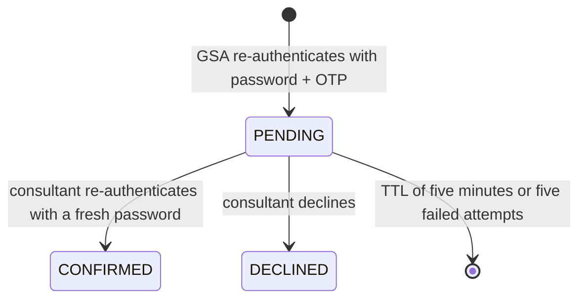

# ADR-018: Global Support Access with a Live Handshake

- Status: Accepted
- Date: 2026-07-26 (supersedes the 2026-07-25 revision)
- Issues: #493, #495, #496, #497

## Context

Global support needs a narrowly scoped way to help one consultant without granting a permanent
tenant, agency, consultant, or advice-seeker identity. The earlier prototype combined identity
creation, re-authentication, Matrix provisioning, and room closure in synchronous database
transactions, and it treated a failed Matrix removal as a closed room. The security state could
therefore disagree with runtime reality, and retries could produce duplicate effects.

The feature crosses four trust boundaries. Keycloak owns authentication and second factors,
UserService owns authorization and leases, Matrix owns room membership and encryption, and the
Admin application owns account provisioning. A successful HTTP response must not imply that an
external action happened unless that state can be proved and retried.

## Decision

### Identity and provisioning

A Global Support Admin (GSA) is a dedicated `Admin` row with type `SUPPORT`, tenant `0`, and the
single Keycloak realm role `global-support-admin`. It inherits no tenant-, agency-, consultant-, or
user-admin authority. Only a Platform Admin may create, disable, or re-enable a GSA.

The operational state lives in `support_admin_profile` and is authoritative for authorization:

```
INVITED → PENDING_2FA → ACTIVE ⇄ DISABLING → DISABLED
                ↘ PROVISIONING_FAILED
```

Provisioning is fail-closed. The Keycloak user is created disabled and without the privileged role;
the admin row and profile are written; a provisioning step then assigns the role, forces a password
change, and requires OTP onboarding; only a successful setup releases the account. A failure leaves
`PROVISIONING_FAILED`, which is visible in the Admin board and never usable.

Every GSA endpoint checks the profile state in addition to the JWT. An already-issued token of a
disabled GSA does not grant access. Disabling immediately blocks new handshakes, moves every active
support session to `REVOCATION_PENDING`, and only then withdraws the Keycloak and Matrix access.

The ordinary account-invite mechanism may be used for onboarding. The no-email rule applies to the
support handshake, not to account creation.

### Handshake

Version 1 exposes only `SUPPORT_ACCESS`. Recovery and identity grants reuse the same internal core
later but have no reachable endpoint or handler in this release, so their different participant and
tenant rules cannot accidentally inherit the support policy.

A request names a consultant **and a concrete agency**. The server validates that the GSA is active
with an enrolled second factor, that its password and OTP are fresh, that the two actors are
different people, that the consultant is active and assigned to that agency, and that no other
unfinished support access exists for the same pair and agency. Target tenant and agency are derived
from the persisted consultant-agency relation, never taken from the JWT or the request body.



Confirmation verifies the signed-in consultant from the token and their fresh password.
`PENDING → CONFIRMED` is a conditional database update; only an update that affected exactly one row
may then create a support session and an outbox job. Confirmation, the `PROVISIONING` session, and
the outbox job are written in one transaction, and Matrix is never called inside it.

Failed attempts are counted on the live session; the fifth failure locks it terminally. On lapse the
operational handshake row is deleted and exactly one `SESSION_NOT_ESTABLISHED` audit entry remains.

Passwords, OTPs, Matrix tokens, and Keycloak responses are neither persisted nor logged. The
existing sensitive-form redaction is extended to cover OTP.

### Support session and Matrix lifecycle

`support_access_session` carries a unique `handshake_id` and the states `PROVISIONING`, `ACTIVE`,
`REVOCATION_PENDING`, `CLOSED`, and `PROVISIONING_FAILED`. A unique `active_lease_key`, set only
while a session is non-terminal, prevents a second parallel session for the same GSA, consultant,
and agency.

A persisted worker processes `PROVISION_ROOM`, `REVOKE_ACCESS`, and `PURGE_CALL_ROOM` idempotently.
Jobs are claimed atomically and retried with backoff.

Each support session gets a **new, non-administrative Matrix identity** for the GSA. It is never
reused in a later session. The worker creates a private room with enforced Matrix end-to-end
encryption, stores the room ID immediately so compensation is possible, invites only the affected
consultant, verifies the join and the expected membership, and only then sets the session `ACTIVE`.
Partial failures remove the created room; after the bounded attempt limit the session becomes
`PROVISIONING_FAILED` and surfaces in the Admin board.

Expiry, manual termination, and disabling all first set `REVOCATION_PENDING` atomically. From that
moment no API or surface reports active access. The worker then deactivates the temporary Matrix
identity, ends and removes the registered Element Call room, deletes the support room through the
Synapse admin API, and verifies that the membership is gone. `CLOSED` is written only after that
verification. Failures stay visible as `REVOCATION_PENDING`, are retried indefinitely, and raise an
operational alert — a Matrix outage never reports `CLOSED`.

Element Call registers its additional call-room ID with the backend so the four-hour revocation
closes both the signalling and the media room.

Message content, files, and call content are never stored in UserService or in the audit.

## API surface

| Endpoint | Authorization and behavior |
| --- | --- |
| `POST /useradmin/supportadmins` | Platform Admin only; create a GSA |
| `GET /useradmin/supportadmins/search` | Platform Admin only; status and second-factor state |
| `POST /useradmin/supportadmins/{id}/disable` | Block the GSA and revoke active access |
| `POST /useradmin/supportadmins/{id}/enable` | Start onboarding or reactivation |
| `GET /useradmin/support-targets/search` | Active GSA only; minimal consultant and agency data |
| `POST /users/support-access/requests` | GSA initiates with `consultantId`, `agencyId`, password, OTP |
| `GET /users/support-access/requests/pending` | Addressed consultant only; popup polling |
| `POST /users/support-access/requests/{id}/confirm` | Consultant confirms; `202 PROVISIONING` |
| `POST /users/support-access/requests/{id}/decline` | Consultant declines explicitly |
| `GET /users/support-access/sessions/active` | Either participant only |
| `POST /users/support-access/sessions/{id}/terminate` | Affected consultant ends it early |
| `PUT /users/support-access/sessions/{id}/call-room` | Registers the encrypted Element Call room |
| `GET /useradmin/support-access/audit` | Filtered server-side by role and organization |

`409` for duplicate or already-confirmed requests, `410` for expired requests, `403` for role or
scope violations, `423` for blocked or not-yet-provisioned GSA accounts.

A GSA never receives a general `/matrix/me/token`. A token is issued only for the temporary Matrix
identity of an active support session.

## Operations and rollout

Audit entries record IDs, timestamp, purpose, target tenant, target agency, outcome, and termination
reason — no messages, secrets, or Matrix tokens — and are deleted after twelve months together with
terminal handshake, session, and job rows.

Metrics and alerts cover pending and active support sessions, the oldest provisioning job,
`REVOCATION_PENDING` older than two minutes, the Matrix retry count, and expired rooms whose removal
is not yet verified.

`support-access.enabled` ships disabled. Turning it off blocks new handshakes while the revocation
worker and the retention job keep running. Rollback is the flag plus disabling the test GSAs;
applied database migrations are not rolled back.

## Consequences and verification

The design introduces eventual consistency between confirmation and room availability, so the UI
must show `PROVISIONING` rather than an active room. In exchange no database lock is held across a
Keycloak or Matrix call, retries are observable, and an external outage cannot silently corrupt the
security state.

Release requires real-MariaDB migration and concurrency tests, a full permission matrix, worker
tests that interrupt every Matrix step, room tests for encryption state and membership, race tests
between expiry, termination, and disabling, Admin and frontend tests, and a browser-visible
two-browser E2E run on Pre-Dev.
