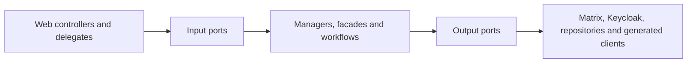

# UserService stability, dependency measurements and module decision

Date: 2026-07-27
Target branch: `pre-dev`

## Reproducible stability result

The historical full-suite baseline contained 4,707 tests, 28 failures, 704 errors
and 10 skipped tests. The failures were not one defect: they combined stale
Spring Security assumptions, test-database replacement, Spring Boot 4 / Jackson
3 migration gaps, incomplete external-service test doubles, stale chat migration
expectations and two production regressions.

The counted classification is machine-readable in
[`user-service-historical-failure-classification.json`](user-service-historical-failure-classification.json).
Its failure clusters sum exactly to 28: 19 obsolete security assertions, two
Actuator contract mismatches, one Rocket.Chat configuration expectation, three
session-locking test doubles and one case each for a Jackson request fixture,
the public-consultant test double and a stale chat aggregate assertion. Its
error clusters sum exactly to 704: 637 errors from replacement H2 datasources
that lost MariaDB compatibility, 22 from the Spring Plugin/HATEOAS ABI mismatch
and 45 whose initial XML retained only Spring's context-failure-threshold
cascade. The artifact names all 15 suites and counts behind those 45 errors and
records the staged reruns used to expose their underlying repair clusters. It
does not invent a more specific original exception where the first report no
longer contained one.

After repairing those clusters, the current candidate completed both broad
suites serially:

| Suite | Tests | Failures | Errors | Skipped | Command |
| --- | ---: | ---: | ---: | ---: | --- |
| Unit | 3,866 | 0 | 0 | 0 | `./mvnw -B -Dskip.integration-tests=true clean test` |
| Integration + contract + E2E | 969 | 0 | 0 | 5 | `ORISO_LOCAL_REDIS_IT=true ./mvnw -B -Dskip.unit-tests=true clean integration-test` |
| MariaDB schema + replica contracts | 9 | 0 | 0 | 0 | required fresh MariaDB 10.11 job |
| Redis replica-safety contracts | 14 | 0 | 0 | 0 | required Redis 7 job |

The candidate includes focused scheduler and Matrix browser-login unit and
replica tests. Those focused tests pass, including the scheduler proof on fresh
MariaDB 10.11 and the browser-login proof on Redis 7. Earlier overlapping broad
attempts remain excluded from evidence; the totals above come only from the
later serial Maven completions. The latest clean integration completion with
the local Redis 7 contract container independently reports 969/0/0/5; the five
skips are the separately required MariaDB 10.11 container contracts.

Nineteen stale security tests were removed. They asserted that safe `GET`
requests or the explicitly CSRF-exempt public registration endpoint require a
CSRF token, which contradicts the service's security contract. No failing test
is skipped or quarantined. Seven email-supplier log regressions were also
re-enabled after their appenders were given the production logger context and a
complete lifecycle. The 30-test focused email-supplier suite now runs with zero
failures, errors or skips.

`scripts/ci/check-no-test-quarantine.py` is exercised by the blocking Python CI
contract suite. It rejects JUnit `@Disabled*` and `@Ignore` annotations anywhere
under `src/test`, so the zero-quarantine state cannot silently regress.

`scripts/ci/run-required-integration-tests.sh` now owns the complete `*IT`
suite, starts from a clean build, requires at least 900 executed tests and
checks for critical E2E reports.
The previous three-test required subset and the non-blocking legacy quarantine
were removed. The broad execution without external containers records fourteen
environment-gated container-level skips: one for each of nine Redis contract
classes and five MariaDB contract classes. They are not quarantine. The
required Redis 7 service-container job executes fourteen test methods from the
nine Redis classes. The required fresh-MariaDB 10.11 job executes nine test
methods from the five MariaDB classes on branch, pull-request and publish
workflows.

The first clean Ubuntu run exposed three portability defects that a warmed local
workspace had hidden. Each Spring test context now owns a unique H2 database so
an evicted `create-drop` context cannot remove another cached context's schema.
Timestamp preservation assertions allow only H2's sub-microsecond rounding.
The Actuator integration test checks liveness rather than aggregate dependency
health; Redis and MariaDB availability remain independently required contracts.

Making the MariaDB contract required exposed and repaired one real production
schema drift: `ReservedPublicSlug.active` declared the SQL default as part of
Hibernate's expected column type. The entity now expects `TINYINT`, while the
default remains correctly owned by Liquibase. A fresh database applies all 95
changesets and passes Hibernate validation.

## Dependency and call measurements

The source inventory contains 13 generated API-controller factories, six
client/configuration helpers and 71 direct `RestTemplate` call sites. The
runtime dependency set is:

| Boundary | Dependencies | Transport |
| --- | --- | --- |
| Identity | Keycloak, identity extensions | Keycloak client + HTTP |
| Chat | Matrix; Rocket.Chat only when explicitly enabled | HTTP long-poll + HTTP; optional MongoDB |
| ORISO services | Agency, Tenant, Consulting Type/Topic/Application Settings, Appointment, Message, Mail, Live | HTTP |
| State/event infrastructure | MariaDB, Redis, RabbitMQ | JDBC, Redis, AMQP |

All `RestTemplateBuilder` clients now emit:

- `userservice.outbound.http.calls`: call attempts by dependency host, method and
  coarse outcome;
- `userservice.outbound.http.latency`: latency with the same low-cardinality
  dimensions and finite 10 ms to 60 s SLO buckets, so p95 can be derived in
  SigNoz instead of having only a `+Inf` bucket;
- `userservice.outbound.http.payload`: exact request bytes and response bytes
  when `Content-Length` is available;
- `userservice.outbound.retries`: explicitly scheduled Keycloak and Matrix
  retries by fixed dependency and operation tags.

Paths, query values, IDs and exception text are never custom metric tags.
Spring Boot's standard `http.client.requests` remains available as an
independent cross-check, but now uses a bounded observation convention:
untemplated URLs are grouped as `uri=untemplated`, and URI templates retain
only their query-free path template.
The asynchronous Java `HttpClient` used by LiveService is wrapped at its
generated-client boundary without editing generated sources. Its attempts,
latency, exact serialized request size, known response size and coarse HTTP or
transport outcome therefore use the same `userservice.outbound.http.*` series.
The client also uses the shared finite transport policy: a 3 s connect timeout
and a 10 s per-request read timeout replace the generated client's otherwise
unbounded waits.
Exceptional futures are observed and logged while live-event delivery remains
best-effort for the initiating business flow.

Keycloak's own admin-client transport uses the same finite 3 s connect and 10 s
read limits through a Keycloak-compatible RESTEasy client, retaining
Keycloak's JSON provider. A transport wrapper measures every admin-client
attempt, latency, exact serialized request size, known response size and
coarse HTTP or transport outcome in the same bounded
`userservice.outbound.http.*` series. Its higher-level retry paths remain
covered by the explicit retry counter. Second-factor operations use the fixed,
low-cardinality operation tags `otp-fetch`, `otp-setup`, `otp-delete`,
`email-verification-start` and `email-verification-finish`; no username, email
address, token or OTP material is emitted as a metric tag.

### Live PreDev baseline before this change

A read-only SigNoz/ClickHouse audit on 2026-07-25 proved that the running
UserService pod was exporting both metrics and traces through the cluster OTel
collector. In an approximately 40-minute active window, the standard client
metric showed:

| Dependency/operation | Calls | Mean latency |
| --- | ---: | ---: |
| Matrix GET 2xx | 138 | 19.36 s |
| Matrix GET 403 | 26 | 3.9 ms |
| Matrix POST 2xx | 9 | 176.1 ms |
| Matrix PUT 2xx | 3 | 262.4 ms |
| Tenant GET 2xx | 6 | 47.4 ms |
| Consulting Type GET 2xx | 8 | 16.2 ms |
| Keycloak GET 2xx | 5 | 19.4 ms |
| Agency GET 2xx | 2 | 36.6 ms |

The Matrix GET mean is dominated by the expected sync long-poll and must not be
read as ordinary request slowness. The audit also found 47 Matrix GET series:
the standard `uri` label included the changing Matrix `since` query parameter.
That real cardinality defect motivated the bounded observation convention
above. Existing standard histograms exposed only the `+Inf` bucket, which
motivated the explicit finite latency buckets.

The audited pod predates this branch. Therefore its live data proves the OTel
pipeline and supplies a baseline, but it does not prove the new
`userservice.outbound.*` metrics, payload sizes, retry counters or cardinality
repair in the shared environment. The local branch-image proof below validates
their runtime registration, tags and finite buckets; the exact image still has
to be deployed and queried through SigNoz before the observability gate is
closed.

## Chatty-call reductions

- With the default `rocket-chat.enabled=false`, account and availability reads
  no longer call Rocket.Chat. Matrix-only deployments also do not create the
  Rocket.Chat MongoDB client or credential job.
- Anonymous live-chat queue visibility is topic-only and therefore avoids an
  AgencyService lookup merely to resolve consulting-type visibility.
- Appointment deletion uses one conditional database `DELETE` and its affected
  row count. It preserves the 404 contract without a read-before-delete round
  trip.
- Agency, consulting-type and topic reference reads share tenant-scoped Redis
  entries across replicas. Their cross-replica cold-load lock suppresses
  duplicate upstream calls, and the hard 60-second TTL replaces replica-local
  three-hour and 24-hour stale windows. Redis failures fail open to the
  authoritative upstream service.
- Username-availability fallback keeps its public fail-open behavior during an
  identity outage, but logs only the bounded exception class. The outbound
  metrics retain attempt/outcome/latency evidence without one full stack trace
  per public request.
- Username-availability reads now consume the focused, provider-neutral
  `IdentityUsernameAvailability` port, and the unused broad identity dependency
  was removed from `UserVerifier`. This is a module-boundary improvement, not a
  call-count reduction: one availability operation still performs exactly two
  adapter-internal identity lookups, one for the decoded and one for the encoded
  username.
- Consultant role-set validation reads the user's complete realm-role list once
  and performs the requested-set intersection in-process. The code-level bound
  is therefore zero identity calls for an empty role set and exactly one for a
  non-empty set, instead of up to one `userHasRole` request per candidate role.
- Application-level single-role checks now use the same focused
  `IdentityRoleLookup` list read and compare the requested application role
  in-process. Each check therefore performs exactly one external full-role
  read; the broad command client no longer exposes role-membership or authority
  reads.
- Email-ownership validation now consumes the focused
  `IdentityEmailOwnerLookup` port and the typed `IdentityEmailOwner` result.
  Application code no longer interprets Keycloak adapter map keys. This is a
  module-boundary improvement, not a call-count reduction: an ownership check
  still performs exactly one external identity lookup.
- Account email writes now consume the focused
  `IdentityEmailAddressUpdater` port. A changed current-account email performs
  one user-representation read, one availability search and one update; an
  unchanged value stops after the single representation read. Deleting the
  current email uses the same path with the adapter-owned dummy address.
  Post-verification updates perform one exact username search and at most one
  update. The broad command client no longer exposes email-address mutations,
  and the adapter no longer reads the same representation twice before a
  write.
- The unused identity session-close command was removed from the broad port,
  the Keycloak facade and its authentication collaborator. It had no production
  consumer, so this removes a misleading command surface and preserves an exact
  zero-call bound without changing the active refresh-token logout flow.
- Login, refresh-token logout and password verification now consume the focused,
  provider-neutral `IdentityAuthentication` port. The broad `IdentityClient`
  no longer exposes authentication operations. This is also a boundary
  improvement rather than a call-count reduction: each authentication operation
  still performs exactly one external identity call.
- OTP retrieval, setup and deletion plus email-verification start and finish now
  consume the focused, provider-neutral `IdentitySecondFactor` port and typed
  application values. Each operation performs exactly one provider request in
  the normal path. Only an initial unauthorized response may refresh the admin
  token and retry exactly once, so the maximum is two provider attempts. The
  fixed retry tags make those retries measurable per operation without leaking
  user data.

The runtime metrics above are the gate for further optimization: prioritize a
dependency only when PreDev shows high calls per request, payload volume or p95
latency. This avoids speculative batching and caches without an invalidation
model.

## Internal module boundaries

The intended dependency direction is:



Rocket.Chat references below describe legacy code that still has to be removed;
they are not part of the target architecture. The target chat transport is
Matrix only, with the ORISO frontend and the controlled MatrixRTC/Element Call
fork using LiveKit. Rocket.Chat and Jitsi are removal targets, not fallbacks or
parallel production transports.

The current state is deliberately tracked per domain instead of describing the
whole codebase as modular:

| Module | Enforced seam | Remaining debt |
| --- | --- | --- |
| Identity/profile | User web entry points use `AccountManaging`, `IdentityManaging` and the application-owned `IdentityPolicy`; web adapters no longer read outbound identity configuration for OTP permissions, consultant display names or Magic Link email classification. Consultant DTO mapping also asks `IdentityManaging` for role decisions instead of calling the outbound identity client. `service.identity` and `service.user` cannot import concrete identity/chat adapters. Profile email propagation uses the `MessageClient` port. Magic-login and password-reset tokens use the shared `OneTimeTokenStore` port with a two-instance Redis contract. Magic-link token exchange returns the provider-neutral `IdentitySession`; only the Keycloak adapter owns grant fields and provider DTO parsing, while the web adapter preserves the existing seven-field snake-case response. Identity creation returns a provider-neutral identifier; the Keycloak adapter owns response parsing and recovers a missing `Location` identifier only from one exact authoritative username match. Login, refresh-token logout and password verification use the focused `IdentityAuthentication` port and provider-neutral `IdentityLogin`; the broad command client no longer exposes authentication. Username availability uses the focused `IdentityUsernameAvailability` port; four active consumers no longer depend on the broad command client for this read, and `UserVerifier` no longer retains an unused identity dependency. Profile lookup uses the focused `IdentityProfileLookup` port and returns `Optional<IdentityProfile>`; Keycloak not-found behavior is mapped to absence, and fuzzy username search stays adapter-internal. Realm-role reads and application role-membership checks use the focused `IdentityRoleLookup` port; the broad command client no longer exposes full role lists, role-membership reads or the unused authority evaluator. Email-owner reads use the focused `IdentityEmailOwnerLookup` port and return `Optional<IdentityEmailOwner>`; provider map keys stay inside the deleted adapter mapping instead of leaking into application logic. OTP and email-verification operations use the focused `IdentitySecondFactor` port and typed application values; generated Keycloak DTOs and string-key maps stay adapter-internal. The unused identity session-close command has been deleted across the broad port and both Keycloak wrappers. | The broad `IdentityClient` still exposes web-layer user command DTOs plus mixed account, provisioning, role-write and lifecycle commands; outbound consumers still use `IdentityClientConfig`. |
| Admin | Chat account creation/update, room checks and group membership use `MatrixUserClient`, `MessageClient` and transport-neutral member IDs; `api.admin` cannot import Matrix/Rocket.Chat adapters. Admin and consultant creation now consume only the provider-neutral identity identifier. | The large admin controller still composes many services. |
| Session/consultant | Room provisioning and assignment depend on `SessionRoomGateway` and `SessionAssignmentChatGateway`; their adapters own Matrix/Rocket.Chat DTOs, credentials, configuration and legacy removal/rollback policy. Both protected application packages have executable import boundaries. | The session-list slice still exposes Rocket.Chat credentials and last-message transport DTOs. |

The identity/profile seam also includes the focused
`IdentityEmailAddressUpdater` for current-account and post-verification writes.
The remaining broad client debt is password/language mutation, provisioning,
role writes and account lifecycle commands.

`tests/ci/test_module_boundaries.py` prevents the stabilized user web slices
from reverting to concrete application/chat services and prevents the
`service.session` application package from importing Matrix or Rocket.Chat
adapters. It also prevents the Identity/Profile packages and the Admin module
from importing their protected concrete chat adapters. The assignment boundary
also forbids the legacy admin Rocket.Chat operation implementation, so rollback
policy cannot leak back into orchestration. The appointment deletion repair
stays behind `Organizing` and `AppointmentRepository`. A separate creation
contract rejects any reintroduction of the deleted
`KeycloakCreateUserResponseDTO` outside the Keycloak adapter boundary. The
identity port contract also rejects imports from the concrete Keycloak adapter
and Keycloak SDK types, so its login and profile results cannot regress from
`IdentityLogin` and `IdentityProfile` to provider transports. A dedicated
Magic-Link boundary contract applies the same rule to the service and both web
entry points. The user-web identity-policy contract rejects direct imports of
outbound identity configuration from the controller and its user delegates.
The web-mapper contract rejects direct imports of the outbound identity client.
The user-data facade contract keeps profile reads off that broad command port.
The role-read contract keeps full realm-role reads and application
role-membership checks behind the focused `IdentityRoleLookup` port, prevents
per-candidate role checks from returning to consultant-agency validation and
rejects role-membership or authority reads on the broad command client. The
email-owner contract likewise keeps the read off the broad command port and
rejects application-level dependence on Keycloak adapter map keys. The
email-mutation contract requires both active consumers and the Keycloak adapter
to use `IdentityEmailAddressUpdater`, and rejects current-account,
post-verification or adapter-internal email writes on the broad client. The
dead-surface contract rejects the unused identity session-close command on the
broad port and both Keycloak wrappers. The
authentication contract keeps login, logout and password verification off the
broad command client and requires every production consumer to depend on the
focused provider-neutral port. The
username-availability contract likewise protects its focused port, names all
four active direct consumers and rejects the unused broad dependency in
`UserVerifier`. The second-factor contract keeps all five OTP and email
verification operations off the broad command client, rejects generated
provider DTOs and string-key maps at application boundaries, and requires the
five fixed retry-operation tags.

Replica-local caches, maps and scheduled side effects are tracked separately in
[`USER_SERVICE_REPLICA_SAFETY.md`](USER_SERVICE_REPLICA_SAFETY.md). The current
runtime contract reports a maximum supported replica count of one; modular
source layout must not be confused with proven multi-instance behavior.

This is a ratcheted incremental modularization, not a claim that all three
domains are already isolated. The next safe sequence is broad identity command
decoupling, then the admin controller composition
boundary, then session-list adapter removal. Each step must add a failing
boundary contract before moving dependencies.

## Microservice decision

Decision: keep UserService as a modular monolith for now.

The suite demonstrates extensive shared transactional behavior and the service
already coordinates at least ten synchronous service boundaries. Splitting a
module before runtime measurements would add more network calls, partial-failure
states and contract deployment sequencing while the current internal ports
already provide the needed seam.

Reconsider extraction only when PreDev telemetry supplies all of:

1. a cohesive module with no shared-database writes across its boundary;
2. independently meaningful ownership and release cadence;
3. sustained call volume or latency that cannot be solved within the process;
4. an explicit versioned contract and failure/retry policy;
5. load and E2E evidence for both sides of the proposed split.

## Load and regression use

Run a bounded load smoke against a deployed environment:

```bash
python3 tests/load/user_service_load_smoke.py \
  --base-url https://userservice.example \
  --path /actuator/health \
  --requests 500 \
  --concurrency 20 \
  --max-error-rate 0 \
  --max-p95-ms 1000
```

Protected endpoints can receive repeated `--header 'Name: value'` arguments.
The script reports request count, error rate, response bytes, throughput and
mean/p50/p95/max latency and exits non-zero when either threshold is exceeded.
Its concurrent behavior is itself exercised by the required Python CI contract.

Local proof on 2026-07-25 used a real started UserService testing process and
500 requests at concurrency 20 against `/actuator/health/liveness`: 0 failures,
0% error rate, 2,996 requests/second, 6.58 ms mean and 17.84 ms p95 (25.98 ms
max). This is a bounded smoke baseline, not a production capacity claim. The
aggregate local health group was `DOWN` because the developer RabbitMQ instance
did not accept the testing profile's credentials; liveness and readiness were
both `UP`, and the dedicated Redis contract passed independently.

Local branch-image proof on 2026-07-26 used
`oriso-userservice:stability-dbb2f3ba`, built from code commit `dbb2f3ba`.
The `dev` profile applied all 95 Liquibase changesets to a disposable fresh
MariaDB 10.11 instance and started with aggregate health, MariaDB, RabbitMQ,
Redis, liveness and readiness all `UP`.

The public topic-availability business path executed 500 requests at
concurrency 20 across HTTP, MariaDB and Redis: 0 failures, 23,000 response
bytes, 547.09 requests/second, 36.31 ms mean and 41.58 ms p95. The application
metric independently recorded exactly 500 successful Redis availability reads.
The identity-unavailable path executed 50 requests at concurrency 5 against a
deliberate upstream 404: all 50 client fallbacks completed, while the new
metrics recorded exactly 50 outbound attempts, 4,650 request bytes and 8,350
response bytes. Forty-nine attempts were in the 10 ms histogram bucket and all
50 were within 50 ms; no scheduled retry metric was created. The log contract
recorded 50 bounded warnings and zero exception stack traces.

This is realistic local branch-image and degradation evidence, not a production
capacity claim or deployed SigNoz proof. The runtime gauge still reports one
supported replica and six remaining local-state components. The exact image
must still be deployed under normal authenticated traffic and queried through
SigNoz before changing either claim.
