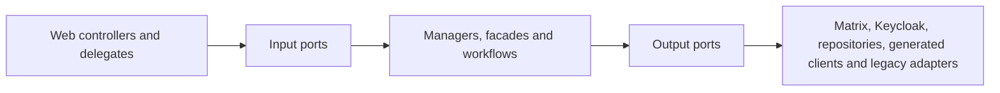

# UserService stability, dependency measurements and module decision

Date: 2026-07-25
Target branch: `pre-dev`

## Reproducible stability result

The historical full-suite baseline contained 4,707 tests, 28 failures, 704 errors
and 10 skipped tests. The failures were not one defect: they combined stale
Spring Security assumptions, test-database replacement, Spring Boot 4 / Jackson
3 migration gaps, incomplete external-service test doubles, stale chat migration
expectations and two production regressions.

After repairing those clusters:

| Suite | Tests | Failures | Errors | Skipped | Command |
| --- | ---: | ---: | ---: | ---: | --- |
| Unit | 3,373 | 0 | 0 | 4 | `./mvnw -Dskip.integration-tests=true test` |
| Integration + contract + E2E | 840 | 0 | 0 | 2 | `scripts/ci/run-required-integration-tests.sh` |
| MariaDB schema contracts | 2 | 0 | 0 | 0 | required fresh MariaDB job |
| Redis availability contract | 1 | 0 | 0 | 0 | required Redis job |

Nineteen stale security tests were removed. They asserted that safe `GET`
requests or the explicitly CSRF-exempt public registration endpoint require a
CSRF token, which contradicts the service's security contract. No failing test
is skipped or quarantined.

`scripts/ci/run-required-integration-tests.sh` now owns the complete `*IT`
suite, starts from a clean build, requires at least 830 executed tests and
checks for critical E2E reports.
The previous three-test required subset and the non-blocking legacy quarantine
were removed. The current Matrix-only floor is 830 tests; the older 900-test
floor included deleted Rocket.Chat-only tests. The two environment-gated cases
are not quarantined: Redis and MariaDB have their own required
service-container/fresh-database jobs on branch, pull-request and publish
workflows.

The first clean Ubuntu run exposed three portability defects that a warmed local
workspace had hidden. Each Spring test context now owns a unique H2 database so
an evicted `create-drop` context cannot remove another cached context's schema.
Timestamp preservation assertions allow only H2's sub-microsecond rounding.
The Actuator integration test checks liveness rather than aggregate dependency
health; Redis and MariaDB availability remain independently required contracts.

Making the MariaDB contract required exposed and repaired one real production
schema drift: `ReservedPublicSlug.active` declared the SQL default as part of
Hibernate's expected column type. The entity now expects `TINYINT`, while the
default remains correctly owned by Liquibase. A fresh database applies all 91
changesets and passes Hibernate validation.

## Dependency and call measurements

The source inventory contains 13 generated API-controller factories, six
client/configuration helpers and 71 direct `RestTemplate` call sites. The
runtime dependency set is:

| Boundary | Dependencies | Transport |
| --- | --- | --- |
| Identity | Keycloak, identity extensions | Keycloak client + HTTP |
| Chat | Matrix only | HTTP long-poll + HTTP |
| ORISO services | Agency, Tenant, Consulting Type/Topic/Application Settings, Appointment, Message, Mail, Live | HTTP |
| State/event infrastructure | MariaDB, Redis, RabbitMQ | JDBC, Redis, AMQP |

All `RestTemplateBuilder` clients now emit:

- `userservice.outbound.http.calls`: call attempts by dependency host, method and
  coarse outcome;
- `userservice.outbound.http.latency`: latency with the same low-cardinality
  dimensions and finite 10 ms to 60 s SLO buckets, so p95 can be derived in
  SigNoz instead of having only a `+Inf` bucket;
- `userservice.outbound.http.payload`: exact request bytes and response bytes
  when `Content-Length` is available;
- `userservice.outbound.retries`: explicitly scheduled Keycloak and Matrix
  retries by fixed dependency and operation tags.

Paths, query values, IDs and exception text are never custom metric tags.
Spring Boot's standard `http.client.requests` remains available as an
independent cross-check, but now uses a bounded observation convention:
untemplated URLs are grouped as `uri=untemplated`, and URI templates retain
only their query-free path template. High-cardinality `http.url` trace
attributes retain only the dependency origin (scheme, host and explicit port),
never a path, query, fragment or user-info value. Every UserService-owned
`RestTemplate`, including the Matrix long-poll and Keycloak extension clients,
installs this convention explicitly and idempotently instead of relying only on
Spring Boot builder auto-configuration.

A read-only PreDev query against the currently deployed pod exposed why this
additional guarantee is necessary: 27 Matrix client spans produced 26 distinct
raw URI values because sync cursors remained in query strings, and historical
Keycloak traces contained dynamic test-identity path segments. No raw values
are copied into this record. This is current-runtime evidence, not proof of this
branch being deployed. After merge and rollout, the aggregate-only verification
query must show zero raw-query URI classes and origin-only `http.url` values.
The Java `HttpClient` used by LiveService is not covered by the payload
interceptor; its higher-level retry paths are covered by the explicit retry
counter. This remains a known measurement boundary, not an implied zero.

Keycloak's own RESTEasy admin-client transport is covered separately by
`KeycloakAdminClientTransport`. It preserves one pooled singleton client (50
connections), bounds connect and connection-checkout waits at three seconds and
read waits at ten seconds, and publishes the same low-cardinality call, latency
and known payload measurements as the Spring HTTP clients. Apache's hidden
transport retries are disabled, so one measured transport attempt equals one
actual HTTP attempt; bounded application retries remain explicit through
`userservice.outbound.retries`. The behavioral transport regression proves a
slow response timeout, pool-exhaustion timeout, one failed HTTP attempt instead
of Apache's previous four attempts, and eight concurrent admin reads sharing
one token acquisition.

Current `pre-dev` has removed the Rocket.Chat production adapter,
configuration, DTOs, database/wire fields and optional MongoDB access.
Matrix/Synapse is the sole messaging backbone, the ORISO frontend remains the
product surface, and LiveKit plus the controlled Element Call/MatrixRTC fork is
the target calling stack. Remaining Rocket.Chat names are limited to the
forward-only removal changelogs, removal/migration contracts and historic
architecture diagrams; they are not a supported runtime or fallback. Jitsi
removal is coordinated outside this UserService-only stability change across
Frontend, call/appointment contracts and deployment.

### Live PreDev baseline before this change

A read-only SigNoz/ClickHouse audit on 2026-07-25 proved that the running
UserService pod was exporting both metrics and traces through the cluster OTel
collector. In an approximately 40-minute active window, the standard client
metric showed:

| Dependency/operation | Calls | Mean latency |
| --- | ---: | ---: |
| Matrix GET 2xx | 138 | 19.36 s |
| Matrix GET 403 | 26 | 3.9 ms |
| Matrix POST 2xx | 9 | 176.1 ms |
| Matrix PUT 2xx | 3 | 262.4 ms |
| Tenant GET 2xx | 6 | 47.4 ms |
| Consulting Type GET 2xx | 8 | 16.2 ms |
| Keycloak GET 2xx | 5 | 19.4 ms |
| Agency GET 2xx | 2 | 36.6 ms |

The Matrix GET mean is dominated by the expected sync long-poll and must not be
read as ordinary request slowness. The audit also found 47 Matrix GET series:
the standard `uri` label included the changing Matrix `since` query parameter.
That real cardinality defect motivated the bounded observation convention
above. Existing standard histograms exposed only the `+Inf` bucket, which
motivated the explicit finite latency buckets.

The audited pod predates this branch. Therefore its live data proves the OTel
pipeline and supplies a baseline, but it does not prove the new
`userservice.outbound.*` metrics, payload sizes, retry counters or cardinality
repair. Those require the branch image to be deployed and queried again.

## Chatty-call reductions

- Rocket.Chat is a complete removal target, never a fallback. Until its legacy
  code is deleted, the default `rocket-chat.enabled=false` prevents account and
  availability reads from calling it and prevents creation of its MongoDB
  client or credential job. Matrix remains the sole intended chat transport;
  Jitsi is likewise not part of the target call stack.
- Anonymous live-chat queue visibility is topic-only and therefore avoids an
  AgencyService lookup merely to resolve consulting-type visibility.
- When the consultant-agency batch read is empty or fails, the local fallback
  performs no per-agency AgencyService retries and loads the lowest known
  consulting type for all agency IDs in one grouped session query. For `N`
  agencies, this changes the failure path from `1 + N` outbound calls plus `N`
  local queries to one outbound batch call plus one local query while
  preserving IDs, topic assignments and configured fallback values. This is
  local code/test evidence until the branch is merged, deployed and measured
  on PreDev.
- Appointment deletion uses one conditional database `DELETE` and its affected
  row count. It preserves the 404 contract without a read-before-delete round
  trip.

The runtime metrics above are the gate for further optimization: prioritize a
dependency only when PreDev shows high calls per request, payload volume or p95
latency. This avoids speculative batching and caches without an invalidation
model.

## Internal module boundaries

The target is Matrix-only. Rocket.Chat references below describe legacy code
that remains to be deleted; they are not an approved fallback or target
adapter. Video calling belongs to the ORISO-controlled Element Call/MatrixRTC
fork with LiveKit, without Jitsi.

The intended dependency direction is:



The current state is deliberately tracked per domain instead of describing the
whole codebase as modular:

| Module | Enforced seam | Remaining debt |
| --- | --- | --- |
| Identity/profile | User web entry points use `AccountManaging` and `IdentityManaging`; `service.identity` and `service.user` cannot import concrete identity/chat adapters. Profile email propagation uses the `MessageClient` port. | The older `IdentityClient` contract and magic-link token exchange still expose Keycloak transport types. |
| Admin | Chat account creation/update, room checks and group membership use `MatrixUserClient`, `MessageClient` and transport-neutral member IDs; `api.admin` cannot import concrete Matrix adapters. | The large admin controller still composes many services, and create-user validation still exposes an older Keycloak response DTO. |
| Session/consultant | Room provisioning and assignment depend on `SessionRoomGateway` and `SessionAssignmentChatGateway`; their adapters own Matrix DTOs, credentials and failure policy. Both protected application packages have executable import boundaries. | Session/consultant orchestration remains broad even though the Rocket.Chat transport has been removed. |

`tests/ci/test_module_boundaries.py` prevents the stabilized user web slices
from reverting to concrete application/chat services and prevents the
`service.session` application package from importing Matrix adapters. It also
prevents the Identity/Profile packages and the Admin module from importing
their protected concrete chat adapters. The separate removal contract prevents
Rocket.Chat production packages, configuration, DTOs and schema fields from
returning. The appointment deletion repair stays behind `Organizing` and
`AppointmentRepository`.

This is a ratcheted incremental modularization, not a claim that all three
domains are already isolated. Rocket.Chat removal is complete in production
source; the next sequence is identity/provisioning cleanup, then smaller Admin
and Session orchestration boundaries. Each step must add a failing boundary
contract before moving dependencies.

## Microservice decision

Decision: keep UserService as a modular monolith for now.

The suite demonstrates extensive shared transactional behavior and the service
already coordinates at least ten synchronous service boundaries. Splitting a
module before runtime measurements would add more network calls, partial-failure
states and contract deployment sequencing while the current internal ports
already provide the needed seam.

Reconsider extraction only when PreDev telemetry supplies all of:

1. a cohesive module with no shared-database writes across its boundary;
2. independently meaningful ownership and release cadence;
3. sustained call volume or latency that cannot be solved within the process;
4. an explicit versioned contract and failure/retry policy;
5. load and E2E evidence for both sides of the proposed split.

## Load and regression use

Run a bounded single-endpoint smoke against a deployed environment:

```bash
python3 tests/load/user_service_load_smoke.py \
  --base-url https://userservice.example \
  --path /actuator/health \
  --requests 500 \
  --concurrency 20 \
  --max-error-rate 0 \
  --max-p95-ms 1000
```

Protected endpoints can receive repeated `--header 'Name: value'` arguments.
The script reports request count, error rate, response bytes, throughput and
mean/p50/p95/max latency and exits non-zero when either threshold is exceeded.

For a weighted workload, pass `--scenario`. The exit threshold applies to the
overall result and every named operation, so a slow low-weight endpoint cannot
hide behind a healthy aggregate. The runner also requires at least one complete
weight cycle.

The reproducible local seeded read proof is:

```bash
bash scripts/load/run-seeded-public-read.sh
```

The runner starts a real UserService testing-profile process with
`UserServiceDatabase.sql` in an isolated H2 database, starts the deterministic
AgencyService batch-read stub, waits for liveness, warms every operation, runs
`tests/load/scenarios/seeded-public-read.json`, and cleans up both processes.
Defaults are 1,400 requests, concurrency 32, zero tolerated failures and a
1,000 ms p95 ceiling. Request count, concurrency and ceiling can be overridden
with `USERSERVICE_LOAD_REQUESTS`, `USERSERVICE_LOAD_CONCURRENCY` and
`USERSERVICE_LOAD_MAX_P95_MS`.

The six operations exercise three seeded consultant profiles, their
agency/topic relations, two agency-language aggregations, the generated
AgencyService HTTP client contract, security/controller/JPA/mapping paths, and
a small liveness control.

Local healthy-dependency proof on 2026-07-25:

| Operation | Requests | Failures | Response bytes | p95 |
| --- | ---: | ---: | ---: | ---: |
| Consultant profile — addiction | 400 | 0 | 148,400 | 128.55 ms |
| Consultant profile — peer | 300 | 0 | 172,500 | 133.77 ms |
| Consultant profile — parenting team | 200 | 0 | 75,000 | 163.93 ms |
| Agency languages — primary | 200 | 0 | 4,000 | 34.89 ms |
| Agency languages — multi | 200 | 0 | 4,000 | 40.47 ms |
| Liveness control | 100 | 0 | 1,500 | 31.92 ms |
| **Overall** | **1,400** | **0** | **405,400** | **114.28 ms** |

The overall run completed in 1.627 seconds at 860.47 requests/second with
35.69 ms mean latency and 343.82 ms maximum latency. This is a bounded local
mixed-read regression proof, not a production capacity claim.

A reproducible two-replica variant is:

```bash
bash scripts/load/run-seeded-public-read-replicas.sh
```

The runner requires Java 21. It retains an already active Java 21 runtime and
auto-selects an installed JDK 21 through `java_home` on macOS; unsupported
runtimes fail before Docker or any dependency state starts.

It packages the real application jar, starts isolated MariaDB 11.0.6 and Redis
7 containers, starts two distinct UserService JVMs against that shared state,
seeds the exact integration-test dataset, and sends requests directly to both
replicas in deterministic round-robin order. Scheduling and external chat event
listeners are disabled so the result isolates the seeded public-read paths. The
CLI reports and enforces thresholds for the aggregate, each operation, and each
replica.

The runner also exposes the normal Micrometer endpoint only on the disposable
local JVMs and captures `userservice.outbound.http.calls`,
`userservice.outbound.http.latency` and
`userservice.outbound.http.payload` immediately before and after the measured
workload. It fails if the AgencyService path is not exercised, produces more
than one call per consultant-profile read, loses a latency/payload measurement,
or exceeds the configured mean-latency or response-payload bounds. The bounds
can be overridden with
`USERSERVICE_LOAD_MAX_AGENCY_CALLS_PER_CONSULTANT_READ`,
`USERSERVICE_LOAD_MAX_AGENCY_MEAN_LATENCY_MS` and
`USERSERVICE_LOAD_MAX_AGENCY_RESPONSE_BYTES_PER_CALL`.

Cleanup removes both JVMs, the dependency containers, the AgencyService stub,
and the temporary run directory.

Local two-replica proof on 2026-07-27:

| Scope | Requests | Failures | Response bytes | Mean | p95 | Max |
| --- | ---: | ---: | ---: | ---: | ---: | ---: |
| Replica one | 700 | 0 | 274,800 | 44.79 ms | 81.29 ms | 183.89 ms |
| Replica two | 700 | 0 | 206,200 | 30.01 ms | 56.67 ms | 218.61 ms |
| **Overall** | **1,400** | **0** | **481,000** | **37.40 ms** | **68.61 ms** | **218.61 ms** |

The current rerun completed in 1.648 seconds at 849.42 requests/second. The
slowest named operation was `consultant-profile-peer` at 82.23 ms p95; all six
operations had zero failures. The measured 900 consultant-profile reads caused
exactly 900 AgencyService calls across both JVMs: 1.0 call per profile read,
6.74 ms mean and 140.55 ms maximum outbound latency, with 260,000 response
bytes in total, 288.89 bytes per call on average and 436 bytes maximum. Every
successful call had a latency and payload measurement.

This proves that the bounded mixed-read scenario can run across two real JVMs
sharing MariaDB and Redis, and that its healthy AgencyService dependency has no
hidden retry or 1+N call amplification. It does **not** yet prove replica safety
for concurrent writes, scheduled jobs, authentication and authorization flows,
Kubernetes service routing, or deployed PreDev behavior. The production
replica maximum must therefore remain one until those paths and their
idempotency/locking contracts are exercised.

The same seeded workload was also run with AgencyService deliberately
unavailable. UserService still returned all 1,400 responses through its local
topic fallback at concurrency 32 (121.19 ms p95, 843.2 requests/second).
However, each failed dependency attempt emitted a WARN stack trace. That proves
fallback continuity while exposing log amplification as a separate operational
risk; it is not equivalent to the healthy-dependency result above.

The earlier control proof on 2026-07-25 used a real started UserService testing process and
500 requests at concurrency 20 against `/actuator/health/liveness`: 0 failures,
0% error rate, 2,996 requests/second, 6.58 ms mean and 17.84 ms p95 (25.98 ms
max). It is retained as a liveness control and is superseded by the seeded mixed
read scenario for application-path evidence. The
aggregate local health group was `DOWN` because the developer RabbitMQ instance
did not accept the testing profile's credentials; liveness and readiness were
both `UP`, and the dedicated Redis contract passed independently.
