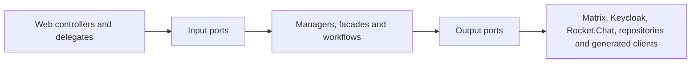

# UserService stability, dependency measurements and module decision

Last verified: 2026-07-27
Target branch: `pre-dev`

## Reproducible stability result

The historical full-suite baseline contained 4,707 tests, 28 failures, 704 errors
and 10 skipped tests. The failures were not one defect: they combined stale
Spring Security assumptions, test-database replacement, Spring Boot 4 / Jackson
3 migration gaps, incomplete external-service test doubles, stale chat migration
expectations and two production regressions.

The counted classification is machine-readable in
[`user-service-historical-failure-classification.json`](user-service-historical-failure-classification.json)
and protected by an executable CI contract. Its failure clusters sum exactly
to 28: 19 obsolete security assertions, two Actuator contract mismatches, one
Rocket.Chat configuration expectation, three session-locking test doubles and
one case each for a Jackson request fixture, the public-consultant test double
and a stale chat aggregate assertion. Its error clusters sum exactly to 704:
637 replacement-H2 datasource failures, 22 Spring Plugin/HATEOAS ABI errors
and 45 initial Spring context-threshold cascades. The artifact preserves the
15-suite breakdown behind those 45 errors and does not invent a more specific
original exception where the retained report did not contain one.

After repairing those clusters:

| Suite | Tests | Failures | Errors | Skipped | Command |
| --- | ---: | ---: | ---: | ---: | --- |
| Unit | 3,373 | 0 | 0 | 0 | `./mvnw -Dskip.integration-tests=true test` |
| Integration + contract + E2E | 840 | 0 | 0 | 2 | `scripts/ci/run-required-integration-tests.sh` |
| MariaDB schema contracts | 2 | 0 | 0 | 0 | required fresh MariaDB job |
| Redis availability contract | 1 | 0 | 0 | 0 | required Redis job |

The rows are not one additive total: the MariaDB and Redis rows are dedicated
environment proofs for cases that belong to the integration inventory. The
comparable primary current inventory is therefore 3,373 unit plus 840
integration executions, or 4,213.

The historical 4,707 figure is the raw failing discovery run, not the same test
inventory with failures simply subtracted. After the original repair work, the
last pre-cutover inventory recorded 3,782 unit and 940 integration executions,
or 4,722. The Matrix-only cutover then changed the executable product and test
inventory to the current 4,213: 409 fewer unit and 100 fewer integration
executions. The source diff for that same pre-cutover-to-current interval
deletes 40 obsolete test classes and adds 29 Matrix-only contract classes.
Thirty-three of the 40 deleted classes cover the removed Rocket.Chat, legacy
chat/import/message, or obsolete session/conversation E2E paths. Because JUnit
execution counts include parameterized and dynamic cases, class counts do not
map one-to-one to the 509-execution net reduction. This is intentional scope
removal plus replacement coverage, not unexplained test quarantine.

Nineteen stale security tests were removed. They asserted that safe `GET`
requests or the explicitly CSRF-exempt public registration endpoint require a
CSRF token, which contradicts the service's security contract. No failing test
is skipped or quarantined.

`scripts/ci/run-required-integration-tests.sh` now owns the complete `*IT`
suite, starts from a clean build, requires at least 830 executed tests and
checks for critical E2E reports.
The previous three-test required subset and the non-blocking legacy quarantine
were removed. On the current Matrix-only `pre-dev` baseline, the four remaining
`NewEnquiryEmailSupplierTest` log assertions run normally. The Matrix cutover
deleted `NewMessageEmailSupplierTest`; this replay deliberately does not restore
that legacy path. A required CI guard rejects newly disabled or ignored tests.
The two environment-gated cases are not quarantined: Redis has its own required
service-container job, and the MariaDB cases run in a required fresh-MariaDB job
on branch, pull-request and publish workflows.

The first clean Ubuntu run exposed three portability defects that a warmed local
workspace had hidden. Each Spring test context now owns a unique H2 database so
an evicted `create-drop` context cannot remove another cached context's schema.
Timestamp preservation assertions allow only H2's sub-microsecond rounding.
The Actuator integration test checks liveness rather than aggregate dependency
health; Redis and MariaDB availability remain independently required contracts.

Making the MariaDB contract required exposed and repaired one real production
schema drift: `ReservedPublicSlug.active` declared the SQL default as part of
Hibernate's expected column type. The entity now expects `TINYINT`, while the
default remains correctly owned by Liquibase. A fresh database applies all 91
changesets and passes Hibernate validation.

## Dependency and call measurements

The source inventory contains 13 generated API-controller factories, six
client/configuration helpers and 71 direct `RestTemplate` call sites. The
runtime dependency set is:

| Boundary | Dependencies | Transport |
| --- | --- | --- |
| Identity | Keycloak, identity extensions | Keycloak client + HTTP |
| Chat | Matrix; remaining Rocket.Chat compatibility code is removal debt, not a supported target mode | HTTP long-poll + HTTP; temporary legacy MongoDB boundary |
| ORISO services | Agency, Tenant, Consulting Type/Topic/Application Settings, Appointment, Message, Mail, Live | HTTP |
| State/event infrastructure | MariaDB, Redis, RabbitMQ | JDBC, Redis, AMQP |

All `RestTemplateBuilder` clients now emit:

- `userservice.outbound.http.calls`: call attempts by dependency host, method and
  coarse outcome;
- `userservice.outbound.http.latency`: latency with the same low-cardinality
  dimensions and finite 10 ms to 60 s SLO buckets, so p95 can be derived in
  SigNoz instead of having only a `+Inf` bucket;
- `userservice.outbound.http.payload`: exact request bytes and response bytes
  when `Content-Length` is available;
- `userservice.outbound.retries`: explicitly scheduled Keycloak and Matrix
  retries by fixed dependency and operation tags.

Paths, query values, IDs and exception text are never custom metric tags.
Spring Boot's standard `http.client.requests` remains available as an
independent cross-check, but now uses a bounded observation convention:
untemplated URLs are grouped as `uri=untemplated`, and URI templates retain
only their query-free path template. High-cardinality `http.url` trace
attributes retain only the dependency origin (scheme, host and explicit port),
never a path, query, fragment or user-info value. Every UserService-owned
`RestTemplate`, including the Matrix long-poll and Keycloak extension clients,
installs this convention explicitly and idempotently instead of relying only on
Spring Boot builder auto-configuration.

A read-only PreDev query against the currently deployed pod exposed why this
additional guarantee is necessary: 27 Matrix client spans produced 26 distinct
raw URI values because sync cursors remained in query strings, and historical
Keycloak traces contained dynamic test-identity path segments. No raw values
are copied into this record. This is current-runtime evidence, not proof of this
branch being deployed. After merge and rollout, the aggregate-only verification
query must show zero raw-query URI classes and origin-only `http.url` values.
The Java `HttpClient` used by LiveService is not covered by the payload
interceptor; its higher-level retry paths are covered by the explicit retry
counter. This remains a known measurement boundary, not an implied zero.

Keycloak's own RESTEasy admin-client transport is covered separately by
`KeycloakAdminClientTransport`. It preserves one pooled singleton client (50
connections), bounds connect and connection-checkout waits at three seconds and
read waits at ten seconds, and publishes the same low-cardinality call, latency
and known payload measurements as the Spring HTTP clients. Apache's hidden
transport retries are disabled, so one measured transport attempt equals one
actual HTTP attempt; bounded application retries remain explicit through
`userservice.outbound.retries`. The behavioral transport regression proves a
slow response timeout, pool-exhaustion timeout, one failed HTTP attempt instead
of Apache's previous four attempts, and eight concurrent admin reads sharing
one token acquisition.

### Live PreDev baseline before this change

A read-only SigNoz/ClickHouse audit on 2026-07-25 proved that the running
UserService pod was exporting both metrics and traces through the cluster OTel
collector. In an approximately 40-minute active window, the standard client
metric showed:

| Dependency/operation | Calls | Mean latency |
| --- | ---: | ---: |
| Matrix GET 2xx | 138 | 19.36 s |
| Matrix GET 403 | 26 | 3.9 ms |
| Matrix POST 2xx | 9 | 176.1 ms |
| Matrix PUT 2xx | 3 | 262.4 ms |
| Tenant GET 2xx | 6 | 47.4 ms |
| Consulting Type GET 2xx | 8 | 16.2 ms |
| Keycloak GET 2xx | 5 | 19.4 ms |
| Agency GET 2xx | 2 | 36.6 ms |

The Matrix GET mean is dominated by the expected sync long-poll and must not be
read as ordinary request slowness. The audit also found 47 Matrix GET series:
the standard `uri` label included the changing Matrix `since` query parameter.
That real cardinality defect motivated the bounded observation convention
above. Existing standard histograms exposed only the `+Inf` bucket, which
motivated the explicit finite latency buckets.

The audited pod predates this branch. Therefore its live data proves the OTel
pipeline and supplies a baseline, but it does not prove the new
`userservice.outbound.*` metrics, payload sizes, retry counters or cardinality
repair. Those require the branch image to be deployed and queried again.

## Chatty-call reductions

- Matrix-only deployments do not call Rocket.Chat for account or availability
  reads and do not create its MongoDB client or credential job. Any remaining
  Rocket.Chat compatibility code is temporary removal debt; the target
  architecture has no Rocket.Chat or Jitsi runtime, fallback or deployment.
- Anonymous live-chat queue visibility is topic-only and therefore avoids an
  AgencyService lookup merely to resolve consulting-type visibility.
- Appointment deletion uses one conditional database `DELETE` and its affected
  row count. It preserves the 404 contract without a read-before-delete round
  trip.

The runtime metrics above are the gate for further optimization: prioritize a
dependency only when PreDev shows high calls per request, payload volume or p95
latency. This avoids speculative batching and caches without an invalidation
model.

## Internal module boundaries

The intended dependency direction is:



The current state is deliberately tracked per domain instead of describing the
whole codebase as modular:

| Module | Enforced seam | Remaining debt |
| --- | --- | --- |
| Identity/profile | User web entry points use `AccountManaging` and `IdentityManaging`; `service.identity` and `service.user` cannot import concrete identity/chat adapters. Profile email propagation uses the `MessageClient` port. | The older `IdentityClient` contract and magic-link token exchange still expose Keycloak transport types. |
| Admin | Chat account creation/update, room checks and group membership use `MatrixUserClient`, `MessageClient` and transport-neutral member IDs; `api.admin` cannot import Matrix/Rocket.Chat adapters. | The large admin controller still composes many services, and create-user validation still exposes an older Keycloak response DTO. |
| Session/consultant | Room provisioning and assignment depend on `SessionRoomGateway` and `SessionAssignmentChatGateway`; their adapters own Matrix/Rocket.Chat DTOs, credentials, configuration and legacy removal/rollback policy. Both protected application packages have executable import boundaries. | The session-list slice still exposes Rocket.Chat credentials and last-message transport DTOs. |
| Live events | Callers use `LiveEventGateway` and transport-neutral events. One long-lived adapter owns generated DTO mapping, client reuse, timeouts, asynchronous failure handling and metrics. An executable import boundary prevents generated LiveService types from leaking back into callers. | Runtime metric readback still requires the branch image on PreDev. |

`tests/ci/test_module_boundaries.py` prevents the stabilized user web slices
from reverting to concrete application/chat services and prevents the
`service.session` application package from importing Matrix or Rocket.Chat
adapters. It also prevents the Identity/Profile packages and the Admin module
from importing their protected concrete chat adapters. The assignment boundary
also forbids the legacy admin Rocket.Chat operation implementation, so rollback
policy cannot leak back into orchestration. The appointment deletion repair
stays behind `Organizing` and `AppointmentRepository`. Live-event callers are
also prevented from importing the generated LiveService transport.

`tests/ci/test_keycloak_transport_boundary.py` keeps RESTEasy construction,
timeouts, pooling and the concrete-engine compatibility workaround local to the
Keycloak admin transport module.

This is a ratcheted incremental modularization, not a claim that all three
domains are already isolated. The next safe sequence is the remaining identity
token/create-user DTO decoupling, then the admin controller composition
boundary, then session-list adapter removal. Each step must add a failing
boundary contract before moving dependencies.

## Microservice decision

Decision: keep UserService as a modular monolith for now.

The suite demonstrates extensive shared transactional behavior and the service
already coordinates at least ten synchronous service boundaries. Splitting a
module before runtime measurements would add more network calls, partial-failure
states and contract deployment sequencing while the current internal ports
already provide the needed seam.

Reconsider extraction only when PreDev telemetry supplies all of:

1. a cohesive module with no shared-database writes across its boundary;
2. independently meaningful ownership and release cadence;
3. sustained call volume or latency that cannot be solved within the process;
4. an explicit versioned contract and failure/retry policy;
5. load and E2E evidence for both sides of the proposed split.

## Load and regression use

Run a bounded load smoke against a deployed environment:

```bash
python3 tests/load/user_service_load_smoke.py \
  --base-url https://userservice.example \
  --path /actuator/health \
  --requests 500 \
  --concurrency 20 \
  --max-error-rate 0 \
  --max-p95-ms 1000
```

Protected endpoints can receive repeated `--header 'Name: value'` arguments.
The script reports request count, error rate, response bytes, throughput and
mean/p50/p95/max latency and exits non-zero when either threshold is exceeded.
Its concurrent behavior is itself exercised by the required Python CI contract.

Local proof on 2026-07-25 used a real started UserService testing process and
500 requests at concurrency 20 against `/actuator/health/liveness`: 0 failures,
0% error rate, 2,996 requests/second, 6.58 ms mean and 17.84 ms p95 (25.98 ms
max). This is a bounded smoke baseline, not a production capacity claim. The
aggregate local health group was `DOWN` because the developer RabbitMQ instance
did not accept the testing profile's credentials; liveness and readiness were
both `UP`, and the dedicated Redis contract passed independently.
