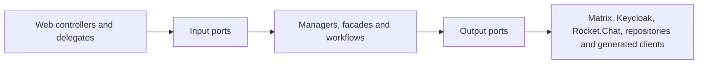

# UserService stability, dependency measurements and module decision

Date: 2026-07-25
Updated: 2026-07-26
Target branch: `pre-dev`

## Reproducible stability result

The historical full-suite baseline contained 4,707 tests, 28 failures, 704 errors
and 10 skipped tests. The failures were not one defect: they combined stale
Spring Security assumptions, test-database replacement, Spring Boot 4 / Jackson
3 migration gaps, incomplete external-service test doubles, stale chat migration
expectations and two production regressions.

After repairing those clusters:

| Suite | Tests | Failures | Errors | Skipped | Command |
| --- | ---: | ---: | ---: | ---: | --- |
| Unit | 3,374 | 0 | 0 | 4 | `./mvnw -Dskip.integration-tests=true test` |
| Integration + contract + E2E | 842 | 0 | 0 | 3 | `scripts/ci/run-required-integration-tests.sh` |
| MariaDB schema contracts | 2 | 0 | 0 | 0 | required fresh MariaDB job |
| Redis availability contract | 1 | 0 | 0 | 0 | required Redis job |

Nineteen stale security tests were removed. They asserted that safe `GET`
requests or the explicitly CSRF-exempt public registration endpoint require a
CSRF token, which contradicts the service's security contract. No failing test
is skipped or quarantined.

`scripts/ci/run-required-integration-tests.sh` now owns the complete `*IT`
suite, starts from a clean build, requires at least 830 executed tests and
checks for critical E2E reports.
The previous three-test required subset and the non-blocking legacy quarantine
were removed. The three environment-gated cases are not quarantined: Redis has
its own required service-container job, and both MariaDB cases run in a required
fresh-MariaDB job on branch, pull-request and publish workflows.

The first clean Ubuntu run exposed three portability defects that a warmed local
workspace had hidden. Each Spring test context now owns a unique H2 database so
an evicted `create-drop` context cannot remove another cached context's schema.
Timestamp preservation assertions allow only H2's sub-microsecond rounding.
The Actuator integration test checks liveness rather than aggregate dependency
health; Redis and MariaDB availability remain independently required contracts.

Making the MariaDB contract required exposed and repaired one real production
schema drift: `ReservedPublicSlug.active` declared the SQL default as part of
Hibernate's expected column type. The entity now expects `TINYINT`, while the
default remains correctly owned by Liquibase. A fresh database applies all 91
changesets and passes Hibernate validation.

## Dependency and call measurements

The source inventory contains 13 generated API-controller factories, six
client/configuration helpers and 71 direct `RestTemplate` call sites. The
runtime dependency set is:

| Boundary | Dependencies | Transport |
| --- | --- | --- |
| Identity | Keycloak, identity extensions | Keycloak client + HTTP |
| Chat | Matrix; Rocket.Chat only when explicitly enabled | HTTP long-poll + HTTP; optional MongoDB |
| ORISO services | Agency, Tenant, Consulting Type/Topic/Application Settings, Appointment, Message, Mail, Live | HTTP |
| State/event infrastructure | MariaDB, Redis, RabbitMQ | JDBC, Redis, AMQP |

All `RestTemplateBuilder` clients now emit:

- `userservice.outbound.http.calls`: call attempts by dependency host, method and
  coarse outcome;
- `userservice.outbound.http.latency`: latency with the same low-cardinality
  dimensions and finite 10 ms to 60 s SLO buckets, so p95 can be derived in
  SigNoz instead of having only a `+Inf` bucket;
- `userservice.outbound.http.payload`: exact request bytes and response bytes
  when `Content-Length` is available;
- `userservice.outbound.retries`: explicitly scheduled Keycloak and Matrix
  retries by fixed dependency and operation tags.

Paths, query values, IDs and exception text are never custom metric tags.
Spring Boot's standard `http.client.requests` remains available as an
independent cross-check, but now uses a bounded observation convention:
untemplated URLs are grouped as `uri=untemplated`, and URI templates retain
only their query-free path template.
The Java `HttpClient` used by LiveService and Keycloak's own admin-client
transport are not covered by the payload interceptor; their higher-level retry
paths are covered by the explicit retry counter. This is a known measurement
boundary, not an implied zero.

### Live PreDev baseline before this change

A read-only SigNoz/ClickHouse audit on 2026-07-25 proved that the running
UserService pod was exporting both metrics and traces through the cluster OTel
collector. In an approximately 40-minute active window, the standard client
metric showed:

| Dependency/operation | Calls | Mean latency |
| --- | ---: | ---: |
| Matrix GET 2xx | 138 | 19.36 s |
| Matrix GET 403 | 26 | 3.9 ms |
| Matrix POST 2xx | 9 | 176.1 ms |
| Matrix PUT 2xx | 3 | 262.4 ms |
| Tenant GET 2xx | 6 | 47.4 ms |
| Consulting Type GET 2xx | 8 | 16.2 ms |
| Keycloak GET 2xx | 5 | 19.4 ms |
| Agency GET 2xx | 2 | 36.6 ms |

The Matrix GET mean is dominated by the expected sync long-poll and must not be
read as ordinary request slowness. The audit also found 47 Matrix GET series:
the standard `uri` label included the changing Matrix `since` query parameter.
That real cardinality defect motivated the bounded observation convention
above. Existing standard histograms exposed only the `+Inf` bucket, which
motivated the explicit finite latency buckets.

The audited pod predates this branch. Therefore its live data proves the OTel
pipeline and supplies a baseline, but it does not prove the new
`userservice.outbound.*` metrics, payload sizes, retry counters or cardinality
repair. Those require the branch image to be deployed and queried again.

### Live PreDev follow-up after the `pre-dev` merge

The 2026-07-26 read-only follow-up kept build, deploy and runtime evidence
separate:

- merge commit `730a9323` published the UserService `pre-dev` image with digest
  `sha256:16534c4d5b0cf8d98b58e164c75bc1ee0320e4597fe28181ab56eee198fe1cfb`;
- the running PreDev deployment still used the older digest
  `sha256:11c0a03cd903d387a6cc229412ac91e1a99b33cb68f1d276e09613d4c4c479e2`;
- no `userservice.*` metric metadata existed in the live SigNoz store.

The merge and image publication are therefore confirmed, but deployment and
the new custom-metric runtime proof remain open.

Approximately 24 hours of traces from that older running image supplied this
baseline:

| Service/client operation | Spans/calls | Errors | p95 latency |
| --- | ---: | ---: | ---: |
| UserService, all spans | 15,732 | 33 | 25.38 ms |
| Matrix POST | 877 | 0 | 47.64 ms |
| Matrix DELETE | 660 | 0 | 26.27 ms |
| Matrix GET | 474 | 1 | about 30 s |
| Matrix PUT | 8 | 0 | 287.16 ms |
| Tenant GET | 14 | 10 | n/a |
| Keycloak GET | 9 | 0 | 16.23 ms |
| Consulting Type GET | 9 | 0 | 20.86 ms |
| Agency GET | 4 | 0 | 28.89 ms |

Of the Matrix GET calls, 462 were expected `/sync` long-polls. Their latency is
not ordinary request slowness. The Tenant errors were 404 responses in a
technical/global context. That context has no tenant-specific branding, so the
canonical tenant-template supplier now returns only the generic application URL
without calling TenantService or ApplicationSettingsService. A unit regression
test proves that both outbound boundaries remain untouched. Runtime
confirmation still requires the repaired branch image to be merged, deployed
and traced.

### Anonymous-deletion repeat loop

Trace grouping identified one concrete chatty-call cause in
`deleteUserAnonymousScheduler.performDeletionWorkflow`:

- six scheduler runs made 1,510 successful Matrix client calls;
- each run averaged about 252 Matrix calls and reached a maximum of 272;
- every root workflow then failed after about 7.5 seconds while the secondary
  error-notification path tried to resolve a tenant template.

The deletion method wrapped both irreversible Matrix actions and database
cleanup in one transaction. When notification failed after the actions, the
exception rolled back database cleanup, so the next scheduler run repeated the
already completed external calls.

The notification step is now best-effort: its runtime failure is logged without
workflow identifiers instead of escaping the transaction. The technical mail
context also no longer performs the TenantService lookup that caused the
observed notification failure, which removes the most frequent trigger.

Measured on this branch after merging `pre-dev`: 3,374 unit executions with
zero failures, zero errors and four skips, and 842 required integration
executions across 78 reports with zero failures, zero errors and three skips.
The focused supplier test and formatting gate also pass.

#### Measured limit of this repair

Catching the notification failure is not sufficient on its own when the
workflow error originates inside the database delete. Reproduced locally in
`DeleteUserAnonymousSchedulerIT`: with the preceding session deletes flushed
and the user detached, `userRepository.delete` takes Hibernate's merge path and
raises

```
org.hibernate.ObjectNotFoundException: No row with the given identifier exists
  for entity [de.caritas.cob.userservice.api.model.Session with id ...]
  at org.hibernate.type.EntityType.replace(EntityType.java:334)
```

which matches the PreDev stack. `DeleteDatabaseAskerAction` catches it and
records a workflow error, the notification then fails and is caught here as
intended — but Hibernate has already marked the transaction rollback-only, so
the commit still fails with `UnexpectedRollbackException` and nothing is
retained. Stubbing the repository to throw reproduces the shape of that failure
but not its consequence, because only a genuine failure poisons the persistence
context; the test therefore provokes the real exception.

Making the deletion commit independently of that poisoned context requires its
own transaction boundary and is tracked separately. Until then the hourly
repeat loop is narrowed to the cases this branch removes, not closed.

## Chatty-call reductions

- With the default `rocket-chat.enabled=false`, account and availability reads
  no longer call Rocket.Chat. Matrix-only deployments also do not create the
  Rocket.Chat MongoDB client or credential job.
- Anonymous live-chat queue visibility is topic-only and therefore avoids an
  AgencyService lookup merely to resolve consulting-type visibility.
- Appointment deletion uses one conditional database `DELETE` and its affected
  row count. It preserves the 404 contract without a read-before-delete round
  trip.

The runtime metrics above are the gate for further optimization: prioritize a
dependency only when PreDev shows high calls per request, payload volume or p95
latency. This avoids speculative batching and caches without an invalidation
model.

## Internal module boundaries

The intended dependency direction is:



The current state is deliberately tracked per domain instead of describing the
whole codebase as modular:

| Module | Enforced seam | Remaining debt |
| --- | --- | --- |
| Identity/profile | User web entry points use `AccountManaging` and `IdentityManaging`; `service.identity` and `service.user` cannot import concrete identity/chat adapters. Profile email propagation uses the `MessageClient` port. | The older `IdentityClient` contract and magic-link token exchange still expose Keycloak transport types. |
| Admin | Chat account creation/update, room checks and group membership use `MatrixUserClient`, `MessageClient` and transport-neutral member IDs; `api.admin` cannot import Matrix/Rocket.Chat adapters. | The large admin controller still composes many services, and create-user validation still exposes an older Keycloak response DTO. |
| Session/consultant | Room provisioning and assignment depend on `SessionRoomGateway` and `SessionAssignmentChatGateway`; their adapters own Matrix/Rocket.Chat DTOs, credentials, configuration and legacy removal/rollback policy. Both protected application packages have executable import boundaries. | The session-list slice still exposes Rocket.Chat credentials and last-message transport DTOs. |

`tests/ci/test_module_boundaries.py` prevents the stabilized user web slices
from reverting to concrete application/chat services and prevents the
`service.session` application package from importing Matrix or Rocket.Chat
adapters. It also prevents the Identity/Profile packages and the Admin module
from importing their protected concrete chat adapters. The assignment boundary
also forbids the legacy admin Rocket.Chat operation implementation, so rollback
policy cannot leak back into orchestration. The appointment deletion repair
stays behind `Organizing` and `AppointmentRepository`.

This is a ratcheted incremental modularization, not a claim that all three
domains are already isolated. The next safe sequence is the remaining identity
token/create-user DTO decoupling, then the admin controller composition
boundary, then session-list adapter removal. Each step must add a failing
boundary contract before moving dependencies.

## Microservice decision

Decision: keep UserService as a modular monolith for now.

The suite demonstrates extensive shared transactional behavior and the service
already coordinates at least ten synchronous service boundaries. Splitting a
module before runtime measurements would add more network calls, partial-failure
states and contract deployment sequencing while the current internal ports
already provide the needed seam.

Reconsider extraction only when PreDev telemetry supplies all of:

1. a cohesive module with no shared-database writes across its boundary;
2. independently meaningful ownership and release cadence;
3. sustained call volume or latency that cannot be solved within the process;
4. an explicit versioned contract and failure/retry policy;
5. load and E2E evidence for both sides of the proposed split.

## Load and regression use

Run a bounded load smoke against a deployed environment:

```bash
python3 tests/load/user_service_load_smoke.py \
  --base-url https://userservice.example \
  --path /actuator/health \
  --requests 500 \
  --concurrency 20 \
  --max-error-rate 0 \
  --max-p95-ms 1000
```

Protected endpoints can receive repeated `--header 'Name: value'` arguments.
The script reports request count, error rate, response bytes, throughput and
mean/p50/p95/max latency and exits non-zero when either threshold is exceeded.
Its concurrent behavior is itself exercised by the required Python CI contract.

Local proof on 2026-07-25 used a real started UserService testing process and
500 requests at concurrency 20 against `/actuator/health/liveness`: 0 failures,
0% error rate, 2,996 requests/second, 6.58 ms mean and 17.84 ms p95 (25.98 ms
max). This is a bounded smoke baseline, not a production capacity claim. The
aggregate local health group was `DOWN` because the developer RabbitMQ instance
did not accept the testing profile's credentials; liveness and readiness were
both `UP`, and the dedicated Redis contract passed independently.
