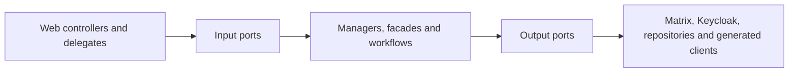

# UserService stability, dependency measurements and module decision

Last verified: 2026-07-29
Target branch: `pre-dev`

## Reproducible stability result

The historical full-suite baseline contained 4,707 tests, 28 failures, 704 errors
and 10 skipped tests. The failures were not one defect: they combined stale
Spring Security assumptions, test-database replacement, Spring Boot 4 / Jackson
3 migration gaps, incomplete external-service test doubles, stale chat migration
expectations and two production regressions.

The counted classification is machine-readable in
[`user-service-historical-failure-classification.json`](user-service-historical-failure-classification.json)
and protected by an executable CI contract. Its failure clusters sum exactly
to 28: 19 obsolete security assertions, two Actuator contract mismatches, one
Rocket.Chat configuration expectation, three session-locking test doubles and
one case each for a Jackson request fixture, the public-consultant test double
and a stale chat aggregate assertion. Its error clusters sum exactly to 704:
637 replacement-H2 datasource failures, 22 Spring Plugin/HATEOAS ABI errors
and 45 initial Spring context-threshold cascades. The artifact preserves the
15-suite breakdown behind those 45 errors and does not invent a more specific
original exception where the retained report did not contain one.

After repairing those clusters:

| Suite | Tests | Failures | Errors | Skipped | Command |
| --- | ---: | ---: | ---: | ---: | --- |
| Unit | 3,556 | 0 | 0 | 0 | `./mvnw -Dskip.integration-tests=true test` |
| Integration + contract + E2E | 860 | 0 | 0 | 9 | `scripts/ci/run-required-integration-tests.sh` |
| MariaDB schema contracts | 2 | 0 | 0 | 0 | required fresh MariaDB job |
| Redis availability contract | 1 | 0 | 0 | 0 | required Redis job |

The rows are not one additive total: the MariaDB and Redis rows are dedicated
environment proofs for cases that belong to the integration inventory. The
comparable primary current inventory is therefore 3,556 unit plus 860
integration executions, or 4,416.

The historical 4,707 figure is the raw failing discovery run, not the same test
inventory with failures simply subtracted. After the original repair work, the
last pre-cutover inventory recorded 3,782 unit and 940 integration executions,
or 4,722. The Matrix-only cutover then changed the executable product and test
inventory to the current 4,416: 226 fewer unit and 80 fewer integration
executions. The preserved cutover source-diff baseline deletes 40 obsolete test
classes and adds 29 Matrix-only contract classes; later stability and invite
work added further executable coverage.
Thirty-three of the 40 deleted classes cover the removed Rocket.Chat, legacy
chat/import/message, or obsolete session/conversation E2E paths. Because JUnit
execution counts include parameterized and dynamic cases, class counts do not
map one-to-one to the 306-execution net reduction. This is intentional scope
removal plus replacement coverage, not unexplained test quarantine.

Nineteen stale security tests were removed. They asserted that safe `GET`
requests or the explicitly CSRF-exempt public registration endpoint require a
CSRF token, which contradicts the service's security contract. No failing test
is skipped or quarantined.

`scripts/ci/run-required-integration-tests.sh` now owns the complete `*IT`
suite, starts from a clean build, preserves the 830-test safety floor, checks
for critical E2E reports and finally requires the exact versioned inventory of
860 executions in 84 reports. The unit workflow applies the same exact-count
gate to all 3,556 unit executions.
The previous three-test required subset and the non-blocking legacy quarantine
were removed. On the current Matrix-only `pre-dev` baseline, the four remaining
`NewEnquiryEmailSupplierTest` log assertions run normally. The Matrix cutover
deleted `NewMessageEmailSupplierTest`; this replay deliberately does not restore
that legacy path. The current Matrix-only floor is 830 tests; the older 900-test
floor included deleted Rocket.Chat-only tests. A required CI guard rejects newly
disabled or ignored tests. The six environment-gated suites account for nine
skipped executions in the generic integration job; they are not quarantined.
The exact identity of all nine executions is versioned in the historical
classification artifact and checked against Surefire XML. A new skip cannot
hide behind the same aggregate count: the inventory gate reports both
unexpected and missing test identities. Every listed execution also names its
required Redis or MariaDB workflow, and a contract verifies that the workflow
sets the required environment and selects the corresponding class.
Redis and MariaDB have their own required service-container/fresh-database jobs
on branch, pull-request and publish workflows.

The first clean Ubuntu run exposed three portability defects that a warmed local
workspace had hidden. Each Spring test context now owns a unique H2 database so
an evicted `create-drop` context cannot remove another cached context's schema.
Timestamp preservation assertions allow only H2's sub-microsecond rounding.
The Actuator integration test checks liveness rather than aggregate dependency
health; Redis and MariaDB availability remain independently required contracts.

Making the MariaDB contract required exposed and repaired one real production
schema drift: `ReservedPublicSlug.active` declared the SQL default as part of
Hibernate's expected column type. The entity now expects `TINYINT`, while the
default remains correctly owned by Liquibase. A fresh database applies all 91
changesets and passes Hibernate validation.

## Dependency and call measurements

The executable
[`user-service-outbound-dependencies.json`](user-service-outbound-dependencies.json)
catalog maps all 11 generated API-controller factories to their configured
dependency and also records every custom HTTP transport construction site.
CI compares that catalog with the production source tree, so adding, removing
or renaming a generated client cannot silently make this inventory stale.
Six additional client/configuration helpers sit behind the generated factories.
Runtime call frequency is measured from metrics and load evidence rather than
being inferred from a fragile count of source expressions. The runtime
dependency set is:

| Boundary | Dependencies | Transport |
| --- | --- | --- |
| Identity | Keycloak, identity extensions | Keycloak client + HTTP |
| Chat | Matrix only | HTTP long-poll + HTTP |
| ORISO services | Agency/Agency Admin, Tenant/Tenant Admin, Consulting Type/Topic/Application Settings, Appointment and Mail | HTTP |
| State/event infrastructure | MariaDB, Redis, RabbitMQ | JDBC, Redis, AMQP |

Rocket.Chat, Jitsi, the former LiveService transport and the former
MessageService client are explicitly absent runtime dependencies in the
catalog. The UserService therefore has no hidden chat or video fallback outside
Matrix.

All `RestTemplateBuilder` clients now emit:

- `userservice.outbound.http.calls`: call attempts by dependency host, method and
  coarse outcome;
- `userservice.outbound.http.latency`: latency with the same low-cardinality
  dimensions and finite 10 ms to 60 s SLO buckets, so p95 can be derived in
  SigNoz instead of having only a `+Inf` bucket;
- `userservice.outbound.http.payload`: exact request bytes and response bytes
  when `Content-Length` is available;
- `userservice.outbound.retries`: explicitly scheduled Keycloak and Matrix
  retries by fixed dependency and operation tags.
- `userservice.dependency.fallbacks`: successful application fallbacks by fixed
  dependency, operation and reason tags.

Paths, query values, IDs and exception text are never custom metric tags.
Spring Boot's standard `http.client.requests` remains available as an
independent cross-check, but now uses a bounded observation convention:
untemplated URLs are grouped as `uri=untemplated`, and URI templates retain
only their query-free path template. High-cardinality `http.url` trace
attributes retain only the dependency origin (scheme, host and explicit port),
never a path, query, fragment or user-info value. Every UserService-owned
`RestTemplate`, including the Matrix long-poll and Keycloak extension clients,
installs this convention explicitly and idempotently instead of relying only on
Spring Boot builder auto-configuration.

A read-only PreDev query against the currently deployed pod exposed why this
additional guarantee is necessary: 27 Matrix client spans produced 26 distinct
raw URI values because sync cursors remained in query strings, and historical
Keycloak traces contained dynamic test-identity path segments. No raw values
are copied into this record. This is current-runtime evidence, not proof of this
branch being deployed. After merge and rollout, the aggregate-only verification
query must show zero raw-query URI classes and origin-only `http.url` values.
The former LiveService Java `HttpClient`, its retry path and its generated
transport schema have been removed. `/liveproxy/send` remains for one provider
contract deprecation cycle as a dependency-free `410 Gone` tombstone; it
performs no outbound call. Issue #903 tracks final route removal after the
compatibility cycle.

Keycloak's own RESTEasy admin-client transport is covered separately by
`KeycloakAdminClientTransport`. It preserves one pooled singleton client (50
connections), bounds connect and connection-checkout waits at three seconds and
read waits at ten seconds, and publishes the same low-cardinality call, latency
and known payload measurements as the Spring HTTP clients. Apache's hidden
transport retries are disabled, so one measured transport attempt equals one
actual HTTP attempt; bounded application retries remain explicit through
`userservice.outbound.retries`. The behavioral transport regression proves a
slow response timeout, pool-exhaustion timeout, one failed HTTP attempt instead
of Apache's previous four attempts, and eight concurrent admin reads sharing
one token acquisition.

The dependency catalog also versions the effective default transport policy:
three-second connect timeout, ten-second ordinary read timeout, 42-second
Matrix long-poll timeout and zero automatic transport retries. These values are
checked against `RestTemplateTimeouts`, so the documentation cannot drift from
the production constants.

The sampled `POST /users/askers/session/new` trace exposed one avoidable
Keycloak call per new agency-held session. A repository-wide authentication
consumer audit then found the same per-call technical-user password grant in
AppointmentService synchronization, TenantService tenant creation and each
uncached operator-DPA lookup. All four server-to-server consumers now use
`TechnicalIdentityTokenProvider`: one synchronized in-memory grant is shared by
concurrent callers on one UserService replica and reused only until a
pre-expiry boundary. Interactive login, anonymous-account login and explicit
password verification continue to use `IdentityAuthentication` directly and
are forbidden from using the technical-token cache by an executable module
contract. No password, refresh token or access token is stored in Redis.

The AgencyService Matrix-credential boundary retains its stricter recovery
contract: a downstream 401 invalidates only the rejected token, schedules at
most one fresh grant and records
`userservice.outbound.retries{dependency=agency-service,operation=matrix-credentials-auth-refresh}`.
The parallel service-path regression sends 64 session creations through the
real `CreateSessionFacade`, holding-room orchestration, Keycloak auth client and
AgencyService credential HTTP client. The healthy path produces one shared
password grant and exactly 64 AgencyService attempts. When the initial token is
rejected, all requests share one refresh, every successful session still makes
exactly one accepted AgencyService call, and total attempts remain bounded at
two per session. A refreshed token rejected again is invalidated without a
third attempt in the same session and is not reused by the next session.
Expiry, zero-lifetime and targeted invalidation remain covered separately.
After warm-up, this removes the observed per-session Keycloak roundtrip and the
equivalent password-grant fan-out from the three additional technical
consumers, while preserving their existing downstream retry policies and the
separate AgencyService public-agency and secret Matrix-credential boundaries.
The complete session service-path increment and exact 3,556-test unit
inventory were verified at `45e7cc2d61200e19188cffb933ce488228ddc374`.

The follow-up repository-wide consumer cut at
`a4135a0c487e1966863ebbff02e939539c1fb8c3` extends that same provider to the
AppointmentService, tenant-creation and operator-DPA clients. Its focused
client tests and executable technical-versus-interactive authentication seam
pass, and the complete unit inventory is 3,558 tests in 406 reports with zero
failures, errors or skips.

Current `pre-dev` source has removed the Rocket.Chat production adapter,
configuration, DTOs, database/wire fields and optional MongoDB access.
Matrix/Synapse is the sole messaging backbone, the ORISO frontend remains the
product surface, and LiveKit plus the controlled Element Call/MatrixRTC fork is
the target calling stack. Remaining Rocket.Chat names are limited to the
forward-only removal changelogs, removal/migration contracts and historic
architecture diagrams; they are not a supported runtime or fallback. Jitsi
removal is coordinated outside this UserService-only stability change across
Frontend, call/appointment contracts and deployment.

### Live PreDev baseline before this change

A read-only SigNoz/ClickHouse audit on 2026-07-25 proved that the running
UserService pod was exporting both metrics and traces through the cluster OTel
collector. In an approximately 40-minute active window, the standard client
metric showed:

| Dependency/operation | Calls | Mean latency |
| --- | ---: | ---: |
| Matrix GET 2xx | 138 | 19.36 s |
| Matrix GET 403 | 26 | 3.9 ms |
| Matrix POST 2xx | 9 | 176.1 ms |
| Matrix PUT 2xx | 3 | 262.4 ms |
| Tenant GET 2xx | 6 | 47.4 ms |
| Consulting Type GET 2xx | 8 | 16.2 ms |
| Keycloak GET 2xx | 5 | 19.4 ms |
| Agency GET 2xx | 2 | 36.6 ms |

The Matrix GET mean is dominated by the expected sync long-poll and must not be
read as ordinary request slowness. The audit also found 47 Matrix GET series:
the standard `uri` label included the changing Matrix `since` query parameter.
That real cardinality defect motivated the bounded observation convention
above. Existing standard histograms exposed only the `+Inf` bucket, which
motivated the explicit finite latency buckets.

The pod audited on July 25 predates this branch. Its data proves the OTel
pipeline and supplies a historical baseline, but it is not evidence for the
current integration head.

### Live PreDev deployment truth on 2026-07-28/29

Read-only cluster and SigNoz audits at 23:53 CEST and again at 00:09 CEST
separate current source from current runtime:

- `origin/pre-dev` remained
  `be15d12f6305f3370e626a0eec131293cceb5624`; integration PR #888 remained
  unmerged.
- The first audit observed one ready UserService replica from the local
  `fe811-20260728` image. Before the second audit the workload was republished
  as the immutable GHCR image
  `sha256:25d0ae8aabe3032b66dc37b1c128635c35ffe5086d1d8d1b41624c660960dea4`.
  Its OCI revision label resolves exactly to the unchanged `pre-dev` commit
  above, not the integration PR head. The replacement pod started at
  00:01 CEST, was ready with zero restarts and ran as the only replica.
- The first pod exported the bounded `userservice.outbound.*` metrics. Its
  cumulative counters contained 73 `live-service` POST attempts, all with
  `async_error`, 8.31 ms mean attempt latency and 138.08 measured request bytes
  per call. That is direct runtime proof that the dead LiveService path in
  #901/#902 has not yet been deployed away. The replacement baseline pod
  produced 146 `LiveService`-matching log records after its restart, independently
  confirming that the old path remains active; the log-record count is not
  treated as an attempt counter.
- Matrix, the MatrixRTC authorization/gateway components, Element Call and
  LiveKit were running. No Rocket.Chat pod or Jitsi workload was present.
- The old `rocketchat` Service nevertheless remained with zero endpoints, and
  `rocketchat-ingress` still routed `/api/v1` traffic to it. The UserService
  deployment also still consumed a ConfigMap containing Rocket.Chat and
  UserService-Mongo configuration keys. No configuration values are copied into
  this evidence.
- A shared MongoDB workload remained because AgencyService and
  ConsultingTypeService still declared MongoDB configuration. Removing the
  UserService/Rocket.Chat keys is therefore separable from deciding whether
  those other services still require the shared database.

The runtime is consequently **not yet a completed Matrix-only cutover**, even
though the current UserService source is. The final gate is an approved
deployment of the reviewed removal slices plus deployment cleanup, followed by
an immutable image readback and a new-pod SigNoz query showing zero
`live-service` attempts and no Rocket.Chat routing or UserService configuration
residue. Jitsi remains a negative workload assertion.

### Live PreDev follow-up after the `pre-dev` merge

The 2026-07-26 read-only follow-up kept build, deploy and runtime evidence
separate:

- merge commit `730a9323` published the UserService `pre-dev` image with digest
  `sha256:16534c4d5b0cf8d98b58e164c75bc1ee0320e4597fe28181ab56eee198fe1cfb`;
- the running PreDev deployment still used the older digest
  `sha256:11c0a03cd903d387a6cc229412ac91e1a99b33cb68f1d276e09613d4c4c479e2`;
- no `userservice.*` metric metadata existed in the live SigNoz store.

The merge and image publication are therefore confirmed, but deployment and
the new custom-metric runtime proof remain open.

Approximately 24 hours of traces from that older running image supplied this
baseline:

| Service/client operation | Spans/calls | Errors | p95 latency |
| --- | ---: | ---: | ---: |
| UserService, all spans | 15,732 | 33 | 25.38 ms |
| Matrix POST | 877 | 0 | 47.64 ms |
| Matrix DELETE | 660 | 0 | 26.27 ms |
| Matrix GET | 474 | 1 | about 30 s |
| Matrix PUT | 8 | 0 | 287.16 ms |
| Tenant GET | 14 | 10 | n/a |
| Keycloak GET | 9 | 0 | 16.23 ms |
| Consulting Type GET | 9 | 0 | 20.86 ms |
| Agency GET | 4 | 0 | 28.89 ms |

Of the Matrix GET calls, 462 were expected `/sync` long-polls. Their latency is
not ordinary request slowness. The Tenant errors were 404 responses in a
technical/global context. That context has no tenant-specific branding, so the
canonical tenant-template supplier now returns only the generic application URL
without calling TenantService or ApplicationSettingsService. A unit regression
test proves that both outbound boundaries remain untouched. Runtime
confirmation still requires the repaired branch image to be merged, deployed
and traced.

### Read-only PreDev refresh on 2026-07-29

A later read-only audit at approximately 10:10 CEST observed the same immutable
UserService digest and pod described above. It still does not contain this
integration branch. The pod had been running for about ten hours and exported
6,043 outbound attempts while the server metric recorded 472 inbound requests.
Those totals must not be divided into a per-request fan-out ratio because they
include Matrix sync and deletion schedulers.

The cumulative dependency measurements on that pod included:

| Dependency/operation | Attempts | Outcome | Mean latency | Known request bytes/call |
| --- | ---: | --- | ---: | ---: |
| Matrix GET | 1,831 | 2xx | 19.86 s | n/a |
| Matrix POST | 1,530 | 2xx | 28.48 ms | n/a |
| Matrix DELETE | 778 | 2xx | 7.31 ms | n/a |
| Keycloak DELETE | 1,589 | 4xx | 2.64 ms | n/a |
| removed LiveService POST | 76 | asynchronous error | 9.27 ms | 139.78 |
| AgencyService GET | 15 | 2xx | 35.33 ms | 0 |

The Matrix GET mean remains dominated by the expected sync long-poll. The
Keycloak DELETE count is a real repeat loop rather than user traffic: ten
failed anonymous-deletion scheduler runs produced 1,583 idempotent
"already absent" warnings covering 162 distinct deletion targets. Thirty
database errors collapsed to three distinct stale `Session` references. The
workflow removed external identities, then hit those stale database relations,
poisoned the transaction and retried the external deletions in the next run.
This independently confirms the failure shape addressed by the per-user
transaction boundary below.

Sampled request traces also supplied direct fan-out evidence:

| Incoming operation | Sampled requests | Client spans/request | Mean request latency | Observed targets |
| --- | ---: | ---: | ---: | --- |
| `POST /users/askers/session/new` | 1 | 8 | 1,056.41 ms | Matrix 5, AgencyService 2, Keycloak 1 |
| `GET /users/sessions/room` | 3 | 2 | 99.06 ms | Matrix 2 |
| `GET /users/sessions/askers` | 2 | 2 | 118.84 ms | Matrix 2 |
| `GET /users/data` | 1 | 1 | 24.06 ms | Keycloak 1 |
| `GET /users/consultants/search` | 1 | 1 | 50.99 ms | AgencyService 1 |
| `GET /useradmin/tenantadmins` | 30 | 0 | 5.01 ms | none |

The low sample count is stated deliberately; it identifies concrete fan-out
without pretending to be a statistically complete route profile. Background
scheduler traces on the old image contained only their root span, so their
dependency calls could be counted but not joined to the root operation. The
reviewed branch must still be deployed before its improved attribution can be
verified.

The infrastructure cutover also remains incomplete. No Rocket.Chat or Jitsi
workload is running, but `rocketchat` Service and `rocketchat-ingress` still
exist with zero endpoints, and Rocket.Chat/Mongo configuration keys are still
injected through the active UserService and AgencyService ConfigMaps. MongoDB
therefore remains a shared workload. The final Matrix-only proof must remove
that routing and configuration residue while preserving the target stack:
ORISO-owned frontend, ORISO-controlled Element Call/MatrixRTC fork and LiveKit.

The deterministic E2E contract declares J01 through J08, and its contract,
managed-actor and trace-context tests pass. The implementation inventory still
fails closed because only J01/J02 exist on the staged E2E branch; J03 through
J08 have no executable journey files yet. A browser run against this stale
deployment cannot satisfy the full release gate.

Current `pre-dev` also acquired a separate test-context merge regression:
`IdentityUsernameAvailability` disappeared from eight shared Keycloak mocks
when the authentication-port change was reconciled. PR #912 restores only that
test contract. Its local 3,543-unit/858-integration/54-CI checks and all GitHub
checks pass, but it remains a separate review item and is not runtime evidence.

### Anonymous-deletion repeat loop

Trace grouping identified one concrete chatty-call cause in
`deleteUserAnonymousScheduler.performDeletionWorkflow`:

- six scheduler runs made 1,510 successful Matrix client calls;
- each run averaged about 252 Matrix calls and reached a maximum of 272;
- every root workflow then failed after about 7.5 seconds while the secondary
  error-notification path tried to resolve a tenant template.

The deletion method wrapped both irreversible Matrix actions and database
cleanup in one transaction. When notification failed after the actions, the
exception rolled back database cleanup, so the next scheduler run repeated the
already completed external calls.

The notification step is now best-effort: its runtime failure is logged without
workflow identifiers instead of escaping the transaction. The technical mail
context also no longer performs the TenantService lookup that caused the
observed notification failure, which removes the most frequent trigger.

Measured on integration source commit
`92069ff7f13642d3c7cb58fab36c1595425dd3ec`: 3,547 unit executions across
403 reports with zero failures, zero errors and no skips, and 860 required
integration executions across 84 reports with zero failures, zero errors and
nine skips. The 77-test CI/architecture suite, 8-test OpenAPI contract suite,
focused 177-test DPA/identity/Keycloak composition and formatting gate also
pass.

#### Measured limit of this repair

Catching the notification failure is not sufficient on its own when the
workflow error originates inside the database delete. Reproduced locally in
`DeleteUserAnonymousSchedulerIT`: with the preceding session deletes flushed
and the user detached, `userRepository.delete` takes Hibernate's merge path and
raises

```
org.hibernate.ObjectNotFoundException: No row with the given identifier exists
  for entity [de.caritas.cob.userservice.api.model.Session with id ...]
  at org.hibernate.type.EntityType.replace(EntityType.java:334)
```

which matches the PreDev stack. `DeleteDatabaseAskerAction` catches it and
records a workflow error, the notification then fails and is caught here as
intended — but Hibernate has already marked the transaction rollback-only, so
the commit still fails with `UnexpectedRollbackException` and nothing is
retained. Stubbing the repository to throw reproduces the shape of that failure
but not its consequence, because only a genuine failure poisons the persistence
context; the test therefore provokes the real exception.

Making the deletion commit independently of that poisoned context requires its
own transaction boundary. That boundary now exists, described below.

#### Per-user transaction boundary

Selection, deletion and notification each own their scope:

- `AnonymousUserDeletionCandidates` reads in a read-only transaction and returns
  user **ids**, not entities. An entity handed across a transaction boundary
  would be detached in the next one, which is what made the delete take
  Hibernate's merge path over an already-initialized session collection in the
  first place. Loading the user inside the deleting transaction removes that
  path entirely.
- `AnonymousUserDeletionUnit` deletes exactly one user under
  `Propagation.REQUIRES_NEW` and commits when it returns.
- `AnonymousUserDeletionBatch` holds no transaction. It catches a failed
  per-user commit, records it as a workflow error and continues with the
  remaining users.
- `DeleteUserAnonymousService` notifies after the batch, outside every deletion
  transaction.

A user whose own transaction is poisoned still cannot be retained — that
transaction is doomed by definition — but it is now the only one lost, and it
is reported rather than silent. Proven in `DeleteUserAnonymousSchedulerIT` with
a genuine `DataIntegrityViolationException`: a leftover `user_agency` row makes
one user's delete violate the restricting foreign key, and the other user in
the same batch is still deleted and committed.

The selection is also filtered to `RegistrationType.ANONYMOUS`. Without that
filter this workflow, configured under `user.anonymous.deleteworkflow.*`, also
selected registered system accounts such as the per-tenant
`group-chat-system-*` users.

## Chatty-call reductions

- The Matrix-only cutover physically removed the Rocket.Chat adapter, credential
  provider, MongoDB client and scheduler. Negative architecture contracts
  prevent those production paths from returning.
- Anonymous live-chat queue visibility is topic-only and therefore avoids an
  AgencyService lookup merely to resolve consulting-type visibility.
- When the consultant-agency batch read is empty or fails, the local fallback
  performs no per-agency AgencyService retries and loads the lowest known
  consulting type for all agency IDs in one grouped session query. For `N`
  agencies, this changes the failure path from `1 + N` outbound calls plus `N`
  local queries to one outbound batch call plus one local query while
  preserving IDs, topic assignments and configured fallback values. This is
  local code/test evidence until the branch is merged, deployed and measured
  on PreDev.
- Appointment deletion uses one conditional database `DELETE` and its affected
  row count. It preserves the 404 contract without a read-before-delete round
  trip.
- Authenticated user-data profile lookup now uses one focused
  `IdentityProfileLookup` call and exposes only five provider-neutral fields
  across the application seam: ID, username, first name, last name and email.
  The Keycloak adapter still performs exactly one user-resource resolution and
  one representation read, with no retry. Provider not-found becomes absence;
  other provider failures retain the token-based facade fallback. This bounds
  the internal payload but does not claim a smaller Keycloak network response.
- Consultant role-set validation reads the user's complete realm-role list once
  and performs the requested-set intersection in-process. The code-level bound
  is therefore zero identity calls for an empty role set and exactly one for a
  non-empty set, instead of up to one `userHasRole` request per candidate role.
- The unused identity session-close command was removed from the broad output
  port, the Keycloak facade and its authentication collaborator. Repository-wide
  tracing found no production consumer, so the removed path has an exact
  zero-call bound. The active refresh-token logout flow remains unchanged.
- All active admin, consultant and user provisioning role assignments use the
  focused `IdentityRoleUpdater` batch
  port. Empty requests cause no identity traffic. Each non-empty attempt makes
  one role-representation lookup per distinct requested role, one batch add and
  one complete-set visibility read; visibility may be read at most three more
  times under the existing bounded retry policy. The add itself is therefore
  one call per attempt independent of role count. Existing consultant
  group-role enablement retains the read-before-write `ensureRoles` behavior,
  which skips roles already assigned. An unauthorized admin session refreshes
  once and retries the complete attempt once. The broad identity client no
  longer exposes a role-assignment command.
- Consultant rollback and group-role disablement use the same focused
  `IdentityRoleUpdater` for batch removal. Empty requests cause no provider
  calls. A non-empty attempt deduplicates requested names, resolves the target
  once, reads the complete assigned-role set once and performs at most one
  batch removal containing every requested role that is present. Missing roles
  cause no write and no per-role lookup. An unauthorized admin session
  refreshes once and retries the complete batch once; other failures retain
  their existing propagation behavior. The broad identity client no longer
  exposes role removal.
- Admin and consultant profile mutations use the focused
  `IdentityProfileUpdater` with exactly five provider-neutral values: username,
  email, tenant ID, first name and last name. Every mutation resolves the target
  once and reads its current representation once. An unchanged email performs
  no availability search and one update; a changed available email performs one
  availability search and one update; a changed unavailable email performs one
  availability search, preserves the conflict response and performs no update.
  The adapter applies no automatic retry, so provider failures retain their
  existing propagation behavior.

The runtime metrics above are the gate for further optimization: prioritize a
dependency only when PreDev shows high calls per request, payload volume or p95
latency. This avoids speculative batching and caches without an invalidation
model.

## Internal module boundaries

The target is Matrix-only. The Rocket.Chat production adapter, configuration,
DTOs and optional MongoDB access have been removed; retained names are limited
to forward-only changelogs, removal contracts and historic evidence. Video
calling belongs to the ORISO-controlled Element Call/MatrixRTC fork with
LiveKit, without Jitsi.

The intended dependency direction is:



The current state is deliberately tracked per domain instead of describing the
whole codebase as modular:

| Module | Enforced seam | Remaining debt |
| --- | --- | --- |
| Identity/profile | User web entry points use `AccountManaging` and `IdentityManaging`; consultant DTO mapping asks `IdentityManaging` for role decisions instead of importing the outbound identity client. `service.identity` and `service.user` cannot import concrete identity/chat adapters. Authenticated profile reads use `IdentityProfileLookup` and a five-field provider-neutral `IdentityProfile`; the user-data facade no longer imports the broad identity command client or Keycloak representations. Admin and consultant profile writes use `IdentityProfileUpdater` and a five-field provider-neutral `IdentityProfileUpdate`; the broad identity command client no longer accepts web-layer profile DTOs. Password writers depend on `IdentityPasswordUpdater`; credential construction and password-policy translation remain inside the Keycloak adapter. Account, asker, consultant and anonymous-user deactivation use the focused provider-neutral `IdentityDeactivator` port. Strict deletion and best-effort rollback use the focused provider-neutral `IdentityAccountRemover` port. Registration-time dummy-email replacement uses the focused provider-neutral `IdentityDummyEmailUpdater` port and value. Account email writes use the focused `IdentityEmailAddressUpdater`; validation, normalization, authenticated-user resolution and provider persistence remain adapter-owned. Profile email changes synchronize the local model and AppointmentService without a legacy MessageService client. Magic-link exchange returns a provider-neutral `api.model.identity.IdentitySession`; only the Keycloak adapter owns grant fields and provider response parsing, while the web adapter maps the application model to the existing seven-field snake-case response. Realm-role reads use the focused `IdentityRoleLookup` port; consultant role-set validation performs one full read instead of one provider request per candidate role. All active admin, consultant and user provisioning role writers plus consultant rollback and group-role disablement use the focused batch `IdentityRoleUpdater`; the broad identity command client owns neither role ensuring, assignment nor removal. Interactive and technical-user authentication use the focused `IdentityAuthentication` port and provider-neutral `IdentityLogin` value. Username availability is isolated behind the provider-neutral `IdentityUsernameAvailability` output port. OTP credential management and email verification use the focused `IdentitySecondFactor` output port and provider-neutral values; generated Keycloak DTOs and string-keyed maps stay inside the adapter. The unused session-close command is absent from the broad port and both Keycloak wrappers. | The older broad `IdentityClient` contract still exposes provider transports in other identity operations. |
| Admin | Chat account creation/update uses `MatrixUserClient`; room membership uses Matrix-native services and transport-neutral member IDs. `api.admin` cannot import concrete Matrix adapters. | The large admin controller still composes many services, and create-user validation still exposes an older Keycloak response DTO. |
| Session/consultant | Room provisioning and assignment depend on `SessionRoomGateway` and `SessionAssignmentChatGateway`; their adapters own Matrix DTOs, credentials and failure policy. Both protected application packages have executable import boundaries. | Session/consultant orchestration remains broad even though the Rocket.Chat transport has been removed. |

`tests/ci/test_module_boundaries.py` prevents the stabilized user web slices
from reverting to concrete application/chat services, prevents user web
mappers from importing the outbound identity client, and prevents the
`service.session` application package from importing concrete Matrix adapters. It also
prevents the Identity/Profile packages and the Admin module from importing
their protected concrete chat adapters. The separate removal contract prevents
Rocket.Chat production packages, configuration, DTOs and schema fields from
returning. A dead-surface contract prevents the unused identity session-close
command from returning on the broad port or either Keycloak wrapper. The
appointment deletion repair stays behind `Organizing` and `AppointmentRepository`.

A dedicated magic-link boundary contract prevents the application service and
both web entry points from importing Keycloak transport types. It also prevents
the public magic-link response DTO from depending on an outbound-port package.
A dedicated profile-read contract keeps user-data facades off the broad
identity client, removes profile lookup from that client and requires shared
Spring identity mocks to provide the focused port.
The role-read contract keeps full realm-role reads behind the focused
`IdentityRoleLookup` port and prevents per-candidate role checks from returning
to consultant-agency validation.

Email-ownership validation now uses the focused
`IdentityEmailOwnerLookup` output port and the application-owned
`IdentityEmailOwner` value. `IdentityManager` no longer interprets Keycloak map
keys, while the Keycloak adapter retains exact-email matching and representation
mapping. The external-call bound is unchanged: one email-ownership check makes
exactly one identity-provider lookup. An unused email remains accepted; raw and
encoded representations of the same username remain accepted; incomplete owner
data is rejected safely.

A separate authentication boundary contract removes login, logout and
password verification from the broad `IdentityClient`. The five live
consumers—`IdentityManager`, anonymous-user creation, the agency Matrix
credential client, appointment synchronization, account validation and both
technical-user onboarding clients—now use `IdentityAuthentication`.
`KeycloakService` alone maps the provider response to `IdentityLogin`. This
changes ownership and transport coupling, not call count: each login, logout or
password-verification operation still performs exactly one outbound Keycloak
operation. The removed legacy alias-message consumer is not restored.

The username-availability boundary reflects the actual current PreDev source,
not the older stacked change: its four direct consumer classes are
`UserController`, `UserRegistrationControllerDelegate`,
`AnonymousUsernameRegistry` and `ConsultantImportService`. The removed
`AskerImportService` path is not restored, and `UserVerifier` no longer retains
an unused broad identity dependency. The focused port does not change the
external API, schema, configuration or failure policy. One availability check
still performs exactly two adapter-internal Keycloak searches, for the decoded
and encoded username. This slice improves ownership and testability; it does
not claim a call reduction or deployed/runtime evidence.

A dedicated second-factor boundary contract keeps OTP and email-verification
operations out of the broad `IdentityClient` contract. Each of the five
operations performs exactly one provider request on its normal path. An initial
unauthorized response can trigger at most one token refresh and one repeated
provider request, for a maximum of two attempts. Retry measurements use five
fixed low-cardinality operation tags (`otp-fetch`, `otp-setup`, `otp-delete`,
`email-verification-start` and `email-verification-finish`) and contain no
username or other user data. The application passes the encoded username
through the focused port; the Keycloak adapter owns provider-specific decoding,
while the verified email mutation continues to use the decoded username.
External APIs, schemas and configuration remain unchanged, and this refactor
does not reduce the number of second-factor provider calls. These are
source-and-local-test guarantees until the branch is merged, deployed and
verified on PreDev.

A dedicated email-mutation contract prevents `IdentityManager` and
`UserAccountService` from returning to the broad `IdentityClient` for account
email writes. A changed current-account email performs one representation read,
one availability search with an exact email match and one provider update. An
unchanged email stops after the representation read with no availability search or update. Current
account deletion follows the same focused path with the adapter-owned dummy
email. A completed email verification performs one username lookup and at most
one provider update; an unchanged verified email remains a no-op after that
lookup. Lowercase normalization uses the locale-independent root locale.
External APIs, schemas and configuration remain unchanged. These are
source-and-local-test guarantees until the branch is merged, deployed and
verified on PreDev.
The role-write contract requires all six active admin, consultant and user role
writers plus shared Spring identity mocks to use the focused batch port, and
prevents role ensuring or assignment from returning to the broad identity
client. The removed Matrix-only AskerImport path is not restored.
The profile-write contract keeps web and Keycloak transport types out of the
focused value, requires both active application writers and shared Spring mocks
to use the port, and removes profile writes from the broad identity client.

The focused password-write boundary covers admin provisioning, consultant
provisioning and imports, user registration and self-service password reset. A
write resolves the target identity once, performs one provider reset and has no
automatic retry. Password-reset token restoration and provisioning rollback
remain application policies; provider credential DTOs and password-policy error
translation remain adapter concerns.

Identity deactivation now has an explicit one-user call bound: the Keycloak
adapter resolves the users resource and user once, reads one representation and
performs at most one update, with no hidden or application retry. The anonymous
deactivation action keeps its existing best-effort error handling; the account,
asker and consultant deletion flows remain strict and preserve their existing
ordering around lifecycle and persistence changes.

Identity account removal now has explicit provider-call bounds. A normal
removal resolves the target once and calls remove once. An unauthorized removal
refreshes the admin session once and retries the complete lookup/remove
operation at most once. Provider not-found handling remains idempotent,
provisioning rollback remains best-effort and strict deletion sequencing is
unchanged.

Registration-time dummy-email replacement now retains only username and tenant
metadata in a provider-neutral value. The Keycloak adapter computes the dummy
address, resolves the target identity once and performs one update. The former
asker-import consumer no longer exists on the Matrix-only baseline; current-user
email deletion remains on the existing email-address operation.

The current Matrix-only graph also removes unused broad `IdentityClient`
constructor dependencies from `SessionSupervisorFacade`,
`ConsultantAgencyRelationCreatorService` and `UserAccountService`. None of
those services performed an identity call. Their Matrix supervision,
consultant-agency relation and account-lifecycle behavior is therefore
unchanged, while the application graph no longer advertises nonexistent
provider coupling. An executable removal contract covers all three consumers
and also keeps the deleted Rocket.Chat adapter, MessageService and LiveService
transport from returning.

This is a ratcheted incremental modularization, not a claim that all three
domains are already isolated. Rocket.Chat removal is complete in production
source. The next safe sequence is the remaining identity create-user DTO
decoupling and further non-authentication identity transport cleanup, then the
Admin controller composition boundary, then smaller Session orchestration
boundaries. Each step must add a failing boundary contract before moving
dependencies.

## Microservice decision

Decision: keep UserService as a modular monolith for now.

The suite demonstrates extensive shared transactional behavior and the
executable dependency catalog already records several synchronous service and
identity boundaries. Splitting a module before runtime measurements would add
more network calls, partial-failure states and contract deployment sequencing
while the current internal ports already provide the needed seam.

Reconsider extraction only when PreDev telemetry supplies all of:

1. a cohesive module with no shared-database writes across its boundary;
2. independently meaningful ownership and release cadence;
3. sustained call volume or latency that cannot be solved within the process;
4. an explicit versioned contract and failure/retry policy;
5. load and E2E evidence for both sides of the proposed split.

## Load and regression use

Run a bounded single-endpoint smoke against a deployed environment:

```bash
python3 tests/load/user_service_load_smoke.py \
  --base-url https://userservice.example \
  --path /actuator/health \
  --requests 500 \
  --concurrency 20 \
  --max-error-rate 0 \
  --max-p95-ms 1000
```

Protected endpoints can receive repeated `--header 'Name: value'` arguments.
The script reports request count, error rate, response bytes, throughput and
mean/p50/p95/max latency and exits non-zero when either threshold is exceeded.

For a weighted workload, pass `--scenario`. The exit threshold applies to the
overall result and every named operation, so a slow low-weight endpoint cannot
hide behind a healthy aggregate. The runner also requires at least one complete
weight cycle.

The reproducible local seeded read proof is:

```bash
bash scripts/load/run-seeded-public-read.sh
```

The runner starts a real UserService testing-profile process with
`UserServiceDatabase.sql` in an isolated H2 database, starts the deterministic
AgencyService batch-read stub, waits for liveness, warms every operation, runs
`tests/load/scenarios/seeded-public-read.json`, and cleans up both processes.
Defaults are 1,400 requests, concurrency 32, zero tolerated failures and a
1,000 ms p95 ceiling. Request count, concurrency and ceiling can be overridden
with `USERSERVICE_LOAD_REQUESTS`, `USERSERVICE_LOAD_CONCURRENCY` and
`USERSERVICE_LOAD_MAX_P95_MS`.

The six operations exercise three seeded consultant profiles, their
agency/topic relations, two agency-language aggregations, the generated
AgencyService HTTP client contract, security/controller/JPA/mapping paths, and
a small liveness control.

Local healthy-dependency proof on 2026-07-25:

| Operation | Requests | Failures | Response bytes | p95 |
| --- | ---: | ---: | ---: | ---: |
| Consultant profile — addiction | 400 | 0 | 148,400 | 128.55 ms |
| Consultant profile — peer | 300 | 0 | 172,500 | 133.77 ms |
| Consultant profile — parenting team | 200 | 0 | 75,000 | 163.93 ms |
| Agency languages — primary | 200 | 0 | 4,000 | 34.89 ms |
| Agency languages — multi | 200 | 0 | 4,000 | 40.47 ms |
| Liveness control | 100 | 0 | 1,500 | 31.92 ms |
| **Overall** | **1,400** | **0** | **405,400** | **114.28 ms** |

The overall run completed in 1.627 seconds at 860.47 requests/second with
35.69 ms mean latency and 343.82 ms maximum latency. This is a bounded local
mixed-read regression proof, not a production capacity claim.

A reproducible two-replica variant is:

```bash
bash scripts/load/run-seeded-public-read-replicas.sh
```

The runner requires Java 21. It retains an already active Java 21 runtime and
auto-selects an installed JDK 21 through `java_home` on macOS; unsupported
runtimes fail before Docker or any dependency state starts.

It packages the real application jar, starts isolated MariaDB 11.0.6 and Redis
7 containers, starts two distinct UserService JVMs against that shared state,
seeds the exact integration-test dataset, and sends requests directly to both
replicas in deterministic round-robin order. Scheduling and external chat event
listeners are disabled so the result isolates the seeded public-read paths. The
CLI reports and enforces thresholds for the aggregate, each operation, and each
replica.

The runner also exposes the normal Micrometer endpoint only on the disposable
local JVMs and captures `userservice.outbound.http.calls`,
`userservice.outbound.http.latency` and
`userservice.outbound.http.payload` immediately before and after the measured
workload. It also captures `userservice.dependency.fallbacks` and requires zero
fallbacks for a healthy dependency. It fails if the AgencyService path is not
exercised, produces more than one call per consultant-profile read, loses a
latency/payload measurement, or exceeds the configured mean-latency or
response-payload bounds. The bounds can be overridden with
`USERSERVICE_LOAD_MAX_AGENCY_CALLS_PER_CONSULTANT_READ`,
`USERSERVICE_LOAD_MAX_AGENCY_MEAN_LATENCY_MS` and
`USERSERVICE_LOAD_MAX_AGENCY_RESPONSE_BYTES_PER_CALL`.

Cleanup removes both JVMs, the dependency containers, the AgencyService stub,
and the temporary run directory.

Local two-replica proof on exact integration head
`92069ff7f13642d3c7cb58fab36c1595425dd3ec` on 2026-07-29:

| Scope | Requests | Failures | Response bytes | Mean | p95 | Max |
| --- | ---: | ---: | ---: | ---: | ---: | ---: |
| Replica one | 700 | 0 | 274,800 | 56.78 ms | 104.16 ms | 223.89 ms |
| Replica two | 700 | 0 | 206,200 | 39.72 ms | 80.56 ms | 190.52 ms |
| **Overall** | **1,400** | **0** | **481,000** | **48.25 ms** | **93.76 ms** | **223.89 ms** |

The exact-head rerun completed in 2.124 seconds at 659.05 requests/second. The
slowest named operation was `consultant-profile-addiction` at 108.18 ms p95; all six
operations had zero failures. The measured 900 consultant-profile reads caused
exactly 900 AgencyService calls across both JVMs: 1.0 call per profile read,
5.90 ms mean and 127.97 ms maximum outbound latency, with 260,000 response
bytes in total, 288.89 bytes per call on average and 436 bytes maximum. Every
successful call had a latency and payload measurement, and the fallback count
was exactly zero.

This proves that the bounded mixed-read scenario can run across two real JVMs
sharing MariaDB and Redis, and that its healthy AgencyService dependency has no
hidden retry or 1+N call amplification. It does **not** yet prove replica safety
for concurrent writes, scheduled jobs, authentication and authorization flows,
Kubernetes service routing, or deployed PreDev behavior. The production
replica maximum must therefore remain one until those paths and their
idempotency/locking contracts are exercised.

The required outage variant is:

```bash
bash scripts/load/run-seeded-public-read-replicas-outage.sh
```

It runs the same two JVMs and shared MariaDB/Redis state while the deterministic
AgencyService stub returns HTTP 503. On exact source head
`92069ff7f13642d3c7cb58fab36c1595425dd3ec`, all 1,400 responses succeeded at
concurrency 32 with 93.16 ms overall p95 and 654.12 requests/second. The 900
consultant-profile reads produced exactly 900 dependency attempts, 900 latency
measurements and 900 `userservice.dependency.fallbacks` measurements: one
attempt and one successful local fallback per read, with 7.57 ms mean and 92.28
ms maximum dependency latency. Error response payloads were also measured at
40 bytes per call.

Fallback use remains fully countable while operator warnings are bounded
independently in each process. The warm-up plus measured outage produced
exactly one fallback warning in each JVM and no
`HttpServerErrorException` stack trace. Later fallbacks within the configured
one-minute window increment the metric and the suppressed-warning count instead
of amplifying logs. The next emitted warning reports how many were suppressed;
consultant, agency, tenant and exception values are never metric tags or
warning fields. This outage proof is required by the MariaDB/replica workflow,
not an ad-hoc local experiment.

The earlier control proof on 2026-07-25 used a real started UserService testing process and
500 requests at concurrency 20 against `/actuator/health/liveness`: 0 failures,
0% error rate, 2,996 requests/second, 6.58 ms mean and 17.84 ms p95 (25.98 ms
max). It is retained as a liveness control and is superseded by the seeded mixed
read scenario for application-path evidence. The
aggregate local health group was `DOWN` because the developer RabbitMQ instance
did not accept the testing profile's credentials; liveness and readiness were
both `UP`, and the dedicated Redis contract passed independently.

Local authenticated-write proof refreshed on 2026-07-28 used two real
UserService JVMs,
one disposable MariaDB 11.0.6 database, shared Redis and a locally signed
consultant JWT verified through a disposable JWK endpoint. Eighty concurrent
tutorial-progress PUTs alternated over both replicas, followed by a read from
each replica: 0 failures, 41.76 ms aggregate p95 and exactly one canonical
database row. After restarting one replica and initializing its authenticated
path on the isolated warm-up scope, 12 further writes and both cross-replica
reads completed with 0 failures and 19.22 ms p95. The runner applies the same
zero-error and 1,000 ms p95 bound per operation and per replica. Startup
liveness and authenticated-path initialization are deliberately separated from
the measured state-transition latency.
The runner allocates its two replica ports and JWK-stub port while all three
allocator sockets are held open, preventing the operating system from returning
the same ephemeral port more than once within the run.
MariaDB's native upsert protects one versioned scope. A database advisory lock,
whose name hashes the user identifier, serializes only first writes for a user
so concurrent replicas cannot exceed the per-user row cap while creating
different scopes. Existing-scope writes do not acquire that lock. Real MariaDB
contracts prove both the cross-replica same-scope race and the different-scope
row-cap race, including lock release after a rejected write.
It introduces no Rocket.Chat or Jitsi configuration or dependency. This is a
bounded authenticated state-transition and restart proof for one slice, not
deployed PreDev or whole-service multi-replica evidence.
