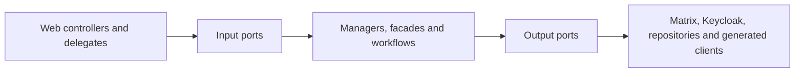

# UserService stability, dependency measurements and module decision

Last verified: 2026-07-28
Target branch: `pre-dev`

## Reproducible stability result

The historical full-suite baseline contained 4,707 tests, 28 failures, 704 errors
and 10 skipped tests. The failures were not one defect: they combined stale
Spring Security assumptions, test-database replacement, Spring Boot 4 / Jackson
3 migration gaps, incomplete external-service test doubles, stale chat migration
expectations and two production regressions.

The counted classification is machine-readable in
[`user-service-historical-failure-classification.json`](user-service-historical-failure-classification.json)
and protected by an executable CI contract. Its failure clusters sum exactly
to 28: 19 obsolete security assertions, two Actuator contract mismatches, one
Rocket.Chat configuration expectation, three session-locking test doubles and
one case each for a Jackson request fixture, the public-consultant test double
and a stale chat aggregate assertion. Its error clusters sum exactly to 704:
637 replacement-H2 datasource failures, 22 Spring Plugin/HATEOAS ABI errors
and 45 initial Spring context-threshold cascades. The artifact preserves the
15-suite breakdown behind those 45 errors and does not invent a more specific
original exception where the retained report did not contain one.

After repairing those clusters:

| Suite | Tests | Failures | Errors | Skipped | Command |
| --- | ---: | ---: | ---: | ---: | --- |
| Unit | 3,438 | 0 | 0 | 0 | `./mvnw -Dskip.integration-tests=true test` |
| Integration + contract + E2E | 850 | 0 | 0 | 9 | `scripts/ci/run-required-integration-tests.sh` |
| MariaDB schema contracts | 2 | 0 | 0 | 0 | required fresh MariaDB job |
| Redis availability contract | 1 | 0 | 0 | 0 | required Redis job |

The rows are not one additive total: the MariaDB and Redis rows are dedicated
environment proofs for cases that belong to the integration inventory. The
comparable primary current inventory is therefore 3,438 unit plus 850
integration executions, or 4,288.

The historical 4,707 figure is the raw failing discovery run, not the same test
inventory with failures simply subtracted. After the original repair work, the
last pre-cutover inventory recorded 3,782 unit and 940 integration executions,
or 4,722. The Matrix-only cutover then changed the executable product and test
inventory to a recorded 4,213: 409 fewer unit and 100 fewer integration
executions. Subsequent stability and boundary work raised the current inventory
to 4,288 without restoring removed legacy paths. The source diff for the
pre-cutover-to-cutover interval
deletes 40 obsolete test classes and adds 29 Matrix-only contract classes.
Thirty-three of the 40 deleted classes cover the removed Rocket.Chat, legacy
chat/import/message, or obsolete session/conversation E2E paths. Because JUnit
execution counts include parameterized and dynamic cases, class counts do not
map one-to-one to the initially recorded 509-execution net reduction. This is
intentional scope removal plus replacement coverage, not unexplained test
quarantine.

Nineteen stale security tests were removed. They asserted that safe `GET`
requests or the explicitly CSRF-exempt public registration endpoint require a
CSRF token, which contradicts the service's security contract. No failing test
is skipped or quarantined.

`scripts/ci/run-required-integration-tests.sh` now owns the complete `*IT`
suite, starts from a clean build, requires at least 830 executed tests and
checks for critical E2E reports.
The previous three-test required subset and the non-blocking legacy quarantine
were removed. On the current Matrix-only `pre-dev` baseline, the four remaining
`NewEnquiryEmailSupplierTest` log assertions run normally. The Matrix cutover
deleted `NewMessageEmailSupplierTest`; this replay deliberately does not restore
that legacy path. The current Matrix-only floor is 830 tests; the older 900-test
floor included deleted Rocket.Chat-only tests. A required CI guard rejects newly
disabled or ignored tests. The two environment-gated cases are not quarantined:
Redis and MariaDB have their own required service-container/fresh-database jobs
on branch, pull-request and publish workflows.

The first clean Ubuntu run exposed three portability defects that a warmed local
workspace had hidden. Each Spring test context now owns a unique H2 database so
an evicted `create-drop` context cannot remove another cached context's schema.
Timestamp preservation assertions allow only H2's sub-microsecond rounding.
The Actuator integration test checks liveness rather than aggregate dependency
health; Redis and MariaDB availability remain independently required contracts.

Making the MariaDB contract required exposed and repaired one real production
schema drift: `ReservedPublicSlug.active` declared the SQL default as part of
Hibernate's expected column type. The entity now expects `TINYINT`, while the
default remains correctly owned by Liquibase. A fresh database applies all 91
changesets and passes Hibernate validation.

## Dependency and call measurements

The source inventory contains 13 generated API-controller factories, six
client/configuration helpers and 71 direct `RestTemplate` call sites. The
runtime dependency set is:

| Boundary | Dependencies | Transport |
| --- | --- | --- |
| Identity | Keycloak, identity extensions | Keycloak client + HTTP |
| Chat | Matrix only | HTTP long-poll + HTTP |
| ORISO services | Agency, Tenant, Consulting Type/Topic/Application Settings, Appointment, Message, Mail, Live | HTTP |
| State/event infrastructure | MariaDB, Redis, RabbitMQ | JDBC, Redis, AMQP |

All `RestTemplateBuilder` clients now emit:

- `userservice.outbound.http.calls`: call attempts by dependency host, method and
  coarse outcome;
- `userservice.outbound.http.latency`: latency with the same low-cardinality
  dimensions and finite 10 ms to 60 s SLO buckets, so p95 can be derived in
  SigNoz instead of having only a `+Inf` bucket;
- `userservice.outbound.http.payload`: exact request bytes and response bytes
  when `Content-Length` is available;
- `userservice.outbound.retries`: explicitly scheduled Keycloak and Matrix
  retries by fixed dependency and operation tags.

Paths, query values, IDs and exception text are never custom metric tags.
Spring Boot's standard `http.client.requests` remains available as an
independent cross-check, but now uses a bounded observation convention:
untemplated URLs are grouped as `uri=untemplated`, and URI templates retain
only their query-free path template. High-cardinality `http.url` trace
attributes retain only the dependency origin (scheme, host and explicit port),
never a path, query, fragment or user-info value. Every UserService-owned
`RestTemplate`, including the Matrix long-poll and Keycloak extension clients,
installs this convention explicitly and idempotently instead of relying only on
Spring Boot builder auto-configuration.

A read-only PreDev query against the currently deployed pod exposed why this
additional guarantee is necessary: 27 Matrix client spans produced 26 distinct
raw URI values because sync cursors remained in query strings, and historical
Keycloak traces contained dynamic test-identity path segments. No raw values
are copied into this record. This is current-runtime evidence, not proof of this
branch being deployed. After merge and rollout, the aggregate-only verification
query must show zero raw-query URI classes and origin-only `http.url` values.
The former LiveService Java `HttpClient`, its retry path and its generated
transport schema have been removed. `/liveproxy/send` remains for one provider
contract deprecation cycle as a dependency-free `410 Gone` tombstone; it
performs no outbound call. Issue #903 tracks final route removal after the
compatibility cycle.

Keycloak's own RESTEasy admin-client transport is covered separately by
`KeycloakAdminClientTransport`. It preserves one pooled singleton client (50
connections), bounds connect and connection-checkout waits at three seconds and
read waits at ten seconds, and publishes the same low-cardinality call, latency
and known payload measurements as the Spring HTTP clients. Apache's hidden
transport retries are disabled, so one measured transport attempt equals one
actual HTTP attempt; bounded application retries remain explicit through
`userservice.outbound.retries`. The behavioral transport regression proves a
slow response timeout, pool-exhaustion timeout, one failed HTTP attempt instead
of Apache's previous four attempts, and eight concurrent admin reads sharing
one token acquisition.

Current `pre-dev` has removed the Rocket.Chat production adapter,
configuration, DTOs, database/wire fields and optional MongoDB access.
Matrix/Synapse is the sole messaging backbone, the ORISO frontend remains the
product surface, and LiveKit plus the controlled Element Call/MatrixRTC fork is
the target calling stack. Remaining Rocket.Chat names are limited to the
forward-only removal changelogs, removal/migration contracts and historic
architecture diagrams; they are not a supported runtime or fallback. Jitsi
removal is coordinated outside this UserService-only stability change across
Frontend, call/appointment contracts and deployment.

### Live PreDev baseline before this change

A read-only SigNoz/ClickHouse audit on 2026-07-25 proved that the running
UserService pod was exporting both metrics and traces through the cluster OTel
collector. In an approximately 40-minute active window, the standard client
metric showed:

| Dependency/operation | Calls | Mean latency |
| --- | ---: | ---: |
| Matrix GET 2xx | 138 | 19.36 s |
| Matrix GET 403 | 26 | 3.9 ms |
| Matrix POST 2xx | 9 | 176.1 ms |
| Matrix PUT 2xx | 3 | 262.4 ms |
| Tenant GET 2xx | 6 | 47.4 ms |
| Consulting Type GET 2xx | 8 | 16.2 ms |
| Keycloak GET 2xx | 5 | 19.4 ms |
| Agency GET 2xx | 2 | 36.6 ms |

The Matrix GET mean is dominated by the expected sync long-poll and must not be
read as ordinary request slowness. The audit also found 47 Matrix GET series:
the standard `uri` label included the changing Matrix `since` query parameter.
That real cardinality defect motivated the bounded observation convention
above. Existing standard histograms exposed only the `+Inf` bucket, which
motivated the explicit finite latency buckets.

The audited pod predates this branch. Therefore its live data proves the OTel
pipeline and supplies a baseline, but it does not prove the new
`userservice.outbound.*` metrics, payload sizes, retry counters or cardinality
repair. Those require the branch image to be deployed and queried again.

## Chatty-call reductions

- The Matrix-only cutover physically removed the Rocket.Chat adapter, credential
  provider, MongoDB client and scheduler. Negative architecture contracts
  prevent those production paths from returning.
- Anonymous live-chat queue visibility is topic-only and therefore avoids an
  AgencyService lookup merely to resolve consulting-type visibility.
- When the consultant-agency batch read is empty or fails, the local fallback
  performs no per-agency AgencyService retries and loads the lowest known
  consulting type for all agency IDs in one grouped session query. For `N`
  agencies, this changes the failure path from `1 + N` outbound calls plus `N`
  local queries to one outbound batch call plus one local query while
  preserving IDs, topic assignments and configured fallback values. This is
  local code/test evidence until the branch is merged, deployed and measured
  on PreDev.
- Appointment deletion uses one conditional database `DELETE` and its affected
  row count. It preserves the 404 contract without a read-before-delete round
  trip.
- Consultant role-set validation reads the user's complete realm-role list once
  and performs the requested-set intersection in-process. The code-level bound
  is therefore zero identity calls for an empty role set and exactly one for a
  non-empty set, instead of up to one `userHasRole` request per candidate role.
- The unused identity session-close command was removed from the broad output
  port, the Keycloak facade and its authentication collaborator. Repository-wide
  tracing found no production consumer, so the removed path has an exact
  zero-call bound. The active refresh-token logout flow remains unchanged.

The runtime metrics above are the gate for further optimization: prioritize a
dependency only when PreDev shows high calls per request, payload volume or p95
latency. This avoids speculative batching and caches without an invalidation
model.

## Internal module boundaries

The target is Matrix-only. The Rocket.Chat production adapter, configuration,
DTOs and optional MongoDB access have been removed; retained names are limited
to forward-only changelogs, removal contracts and historic evidence. Video
calling belongs to the ORISO-controlled Element Call/MatrixRTC fork with
LiveKit, without Jitsi.

The intended dependency direction is:



The current state is deliberately tracked per domain instead of describing the
whole codebase as modular:

| Module | Enforced seam | Remaining debt |
| --- | --- | --- |
| Identity/profile | User web entry points use `AccountManaging` and `IdentityManaging`; consultant DTO mapping asks `IdentityManaging` for role decisions instead of importing the outbound identity client. `service.identity` and `service.user` cannot import concrete identity/chat adapters. Account email writes use the focused `IdentityEmailAddressUpdater`; validation, normalization, authenticated-user resolution and provider persistence remain adapter-owned. Profile email propagation uses the `MessageClient` port. Magic-link exchange returns a provider-neutral `api.model.identity.IdentitySession`; only the Keycloak adapter owns grant fields and provider response parsing, while the web adapter maps the application model to the existing seven-field snake-case response. Realm-role reads use the focused `IdentityRoleLookup` port; consultant role-set validation performs one full read instead of one provider request per candidate role. Interactive and technical-user authentication use the focused `IdentityAuthentication` port and provider-neutral `IdentityLogin` value. Username availability is isolated behind the provider-neutral `IdentityUsernameAvailability` output port. OTP credential management and email verification use the focused `IdentitySecondFactor` output port and provider-neutral values; generated Keycloak DTOs and string-keyed maps stay inside the adapter. The unused session-close command is absent from the broad port and both Keycloak wrappers. | The older broad `IdentityClient` contract still exposes provider transports in other identity operations. |
| Admin | Chat account creation/update, room checks and group membership use `MatrixUserClient`, `MessageClient` and transport-neutral member IDs; `api.admin` cannot import concrete Matrix adapters. | The large admin controller still composes many services, and create-user validation still exposes an older Keycloak response DTO. |
| Session/consultant | Room provisioning and assignment depend on `SessionRoomGateway` and `SessionAssignmentChatGateway`; their adapters own Matrix DTOs, credentials and failure policy. Both protected application packages have executable import boundaries. | Session/consultant orchestration remains broad even though the Rocket.Chat transport has been removed. |

`tests/ci/test_module_boundaries.py` prevents the stabilized user web slices
from reverting to concrete application/chat services, prevents user web
mappers from importing the outbound identity client, and prevents the
`service.session` application package from importing concrete Matrix adapters. It also
prevents the Identity/Profile packages and the Admin module from importing
their protected concrete chat adapters. The separate removal contract prevents
Rocket.Chat production packages, configuration, DTOs and schema fields from
returning. A dead-surface contract prevents the unused identity session-close
command from returning on the broad port or either Keycloak wrapper. The
appointment deletion repair stays behind `Organizing` and `AppointmentRepository`.

A dedicated magic-link boundary contract prevents the application service and
both web entry points from importing Keycloak transport types. It also prevents
the public magic-link response DTO from depending on an outbound-port package.
The role-read contract keeps full realm-role reads behind the focused
`IdentityRoleLookup` port and prevents per-candidate role checks from returning
to consultant-agency validation.

Email-ownership validation now uses the focused
`IdentityEmailOwnerLookup` output port and the application-owned
`IdentityEmailOwner` value. `IdentityManager` no longer interprets Keycloak map
keys, while the Keycloak adapter retains exact-email matching and representation
mapping. The external-call bound is unchanged: one email-ownership check makes
exactly one identity-provider lookup. An unused email remains accepted; raw and
encoded representations of the same username remain accepted; incomplete owner
data is rejected safely.

A separate authentication boundary contract removes login, logout and
password verification from the broad `IdentityClient`. The five live
consumers—`IdentityManager`, anonymous-user creation, the agency Matrix
credential client, appointment synchronization and account validation—now use
`IdentityAuthentication`. `KeycloakService` alone maps the provider response to
`IdentityLogin`. This changes ownership and transport coupling, not call count:
each login, logout or password-verification operation still performs exactly
one outbound Keycloak operation. The removed legacy alias-message consumer is
not restored.

The username-availability boundary reflects the actual current PreDev source,
not the older stacked change: its four direct consumer classes are
`UserController`, `UserRegistrationControllerDelegate`,
`AnonymousUsernameRegistry` and `ConsultantImportService`. The removed
`AskerImportService` path is not restored, and `UserVerifier` no longer retains
an unused broad identity dependency. The focused port does not change the
external API, schema, configuration or failure policy. One availability check
still performs exactly two adapter-internal Keycloak searches, for the decoded
and encoded username. This slice improves ownership and testability; it does
not claim a call reduction or deployed/runtime evidence.

A dedicated second-factor boundary contract keeps OTP and email-verification
operations out of the broad `IdentityClient` contract. Each of the five
operations performs exactly one provider request on its normal path. An initial
unauthorized response can trigger at most one token refresh and one repeated
provider request, for a maximum of two attempts. Retry measurements use five
fixed low-cardinality operation tags (`otp-fetch`, `otp-setup`, `otp-delete`,
`email-verification-start` and `email-verification-finish`) and contain no
username or other user data. The application passes the encoded username
through the focused port; the Keycloak adapter owns provider-specific decoding,
while the verified email mutation continues to use the decoded username.
External APIs, schemas and configuration remain unchanged, and this refactor
does not reduce the number of second-factor provider calls. These are
source-and-local-test guarantees until the branch is merged, deployed and
verified on PreDev.

A dedicated email-mutation contract prevents `IdentityManager` and
`UserAccountService` from returning to the broad `IdentityClient` for account
email writes. A changed current-account email performs one representation read,
one availability search with an exact email match and one provider update. An
unchanged email stops after the representation read with no availability search or update. Current
account deletion follows the same focused path with the adapter-owned dummy
email. A completed email verification performs one username lookup and at most
one provider update; an unchanged verified email remains a no-op after that
lookup. Lowercase normalization uses the locale-independent root locale.
External APIs, schemas and configuration remain unchanged. These are
source-and-local-test guarantees until the branch is merged, deployed and
verified on PreDev.

This is a ratcheted incremental modularization, not a claim that all three
domains are already isolated. Rocket.Chat removal is complete in production
source. The next safe sequence is the remaining identity create-user DTO
decoupling and further non-authentication identity transport cleanup, then the
Admin controller composition boundary, then smaller Session orchestration
boundaries. Each step must add a failing boundary contract before moving
dependencies.

## Microservice decision

Decision: keep UserService as a modular monolith for now.

The suite demonstrates extensive shared transactional behavior and the service
already coordinates at least ten synchronous service boundaries. Splitting a
module before runtime measurements would add more network calls, partial-failure
states and contract deployment sequencing while the current internal ports
already provide the needed seam.

Reconsider extraction only when PreDev telemetry supplies all of:

1. a cohesive module with no shared-database writes across its boundary;
2. independently meaningful ownership and release cadence;
3. sustained call volume or latency that cannot be solved within the process;
4. an explicit versioned contract and failure/retry policy;
5. load and E2E evidence for both sides of the proposed split.

## Load and regression use

Run a bounded single-endpoint smoke against a deployed environment:

```bash
python3 tests/load/user_service_load_smoke.py \
  --base-url https://userservice.example \
  --path /actuator/health \
  --requests 500 \
  --concurrency 20 \
  --max-error-rate 0 \
  --max-p95-ms 1000
```

Protected endpoints can receive repeated `--header 'Name: value'` arguments.
The script reports request count, error rate, response bytes, throughput and
mean/p50/p95/max latency and exits non-zero when either threshold is exceeded.

For a weighted workload, pass `--scenario`. The exit threshold applies to the
overall result and every named operation, so a slow low-weight endpoint cannot
hide behind a healthy aggregate. The runner also requires at least one complete
weight cycle.

The reproducible local seeded read proof is:

```bash
bash scripts/load/run-seeded-public-read.sh
```

The runner starts a real UserService testing-profile process with
`UserServiceDatabase.sql` in an isolated H2 database, starts the deterministic
AgencyService batch-read stub, waits for liveness, warms every operation, runs
`tests/load/scenarios/seeded-public-read.json`, and cleans up both processes.
Defaults are 1,400 requests, concurrency 32, zero tolerated failures and a
1,000 ms p95 ceiling. Request count, concurrency and ceiling can be overridden
with `USERSERVICE_LOAD_REQUESTS`, `USERSERVICE_LOAD_CONCURRENCY` and
`USERSERVICE_LOAD_MAX_P95_MS`.

The six operations exercise three seeded consultant profiles, their
agency/topic relations, two agency-language aggregations, the generated
AgencyService HTTP client contract, security/controller/JPA/mapping paths, and
a small liveness control.

Local healthy-dependency proof on 2026-07-25:

| Operation | Requests | Failures | Response bytes | p95 |
| --- | ---: | ---: | ---: | ---: |
| Consultant profile — addiction | 400 | 0 | 148,400 | 128.55 ms |
| Consultant profile — peer | 300 | 0 | 172,500 | 133.77 ms |
| Consultant profile — parenting team | 200 | 0 | 75,000 | 163.93 ms |
| Agency languages — primary | 200 | 0 | 4,000 | 34.89 ms |
| Agency languages — multi | 200 | 0 | 4,000 | 40.47 ms |
| Liveness control | 100 | 0 | 1,500 | 31.92 ms |
| **Overall** | **1,400** | **0** | **405,400** | **114.28 ms** |

The overall run completed in 1.627 seconds at 860.47 requests/second with
35.69 ms mean latency and 343.82 ms maximum latency. This is a bounded local
mixed-read regression proof, not a production capacity claim.

A reproducible two-replica variant is:

```bash
bash scripts/load/run-seeded-public-read-replicas.sh
```

The runner requires Java 21. It retains an already active Java 21 runtime and
auto-selects an installed JDK 21 through `java_home` on macOS; unsupported
runtimes fail before Docker or any dependency state starts.

It packages the real application jar, starts isolated MariaDB 11.0.6 and Redis
7 containers, starts two distinct UserService JVMs against that shared state,
seeds the exact integration-test dataset, and sends requests directly to both
replicas in deterministic round-robin order. Scheduling and external chat event
listeners are disabled so the result isolates the seeded public-read paths. The
CLI reports and enforces thresholds for the aggregate, each operation, and each
replica.

The runner also exposes the normal Micrometer endpoint only on the disposable
local JVMs and captures `userservice.outbound.http.calls`,
`userservice.outbound.http.latency` and
`userservice.outbound.http.payload` immediately before and after the measured
workload. It fails if the AgencyService path is not exercised, produces more
than one call per consultant-profile read, loses a latency/payload measurement,
or exceeds the configured mean-latency or response-payload bounds. The bounds
can be overridden with
`USERSERVICE_LOAD_MAX_AGENCY_CALLS_PER_CONSULTANT_READ`,
`USERSERVICE_LOAD_MAX_AGENCY_MEAN_LATENCY_MS` and
`USERSERVICE_LOAD_MAX_AGENCY_RESPONSE_BYTES_PER_CALL`.

Cleanup removes both JVMs, the dependency containers, the AgencyService stub,
and the temporary run directory.

Local two-replica proof on exact integration head
`7255db9b562c208758e5f4a359708baaf3fc043e` on 2026-07-28:

| Scope | Requests | Failures | Response bytes | Mean | p95 | Max |
| --- | ---: | ---: | ---: | ---: | ---: | ---: |
| Replica one | 700 | 0 | 274,800 | 55.41 ms | 102.71 ms | 225.26 ms |
| Replica two | 700 | 0 | 206,200 | 44.22 ms | 92.66 ms | 204.29 ms |
| **Overall** | **1,400** | **0** | **481,000** | **49.82 ms** | **95.38 ms** | **225.26 ms** |

The exact-head rerun completed in 2.209 seconds at 633.63 requests/second. The
slowest named operation was `consultant-profile-addiction` at 107.51 ms p95; all six
operations had zero failures. The measured 900 consultant-profile reads caused
exactly 900 AgencyService calls across both JVMs: 1.0 call per profile read,
8.87 ms mean and 101.91 ms maximum outbound latency, with 260,000 response
bytes in total, 288.89 bytes per call on average and 436 bytes maximum. Every
successful call had a latency and payload measurement.

This proves that the bounded mixed-read scenario can run across two real JVMs
sharing MariaDB and Redis, and that its healthy AgencyService dependency has no
hidden retry or 1+N call amplification. It does **not** yet prove replica safety
for concurrent writes, scheduled jobs, authentication and authorization flows,
Kubernetes service routing, or deployed PreDev behavior. The production
replica maximum must therefore remain one until those paths and their
idempotency/locking contracts are exercised.

The same seeded workload was also run with AgencyService deliberately
unavailable. UserService still returned all 1,400 responses through its local
topic fallback at concurrency 32 (121.19 ms p95, 843.2 requests/second).
However, each failed dependency attempt emitted a WARN stack trace. That proves
fallback continuity while exposing log amplification as a separate operational
risk; it is not equivalent to the healthy-dependency result above.

The earlier control proof on 2026-07-25 used a real started UserService testing process and
500 requests at concurrency 20 against `/actuator/health/liveness`: 0 failures,
0% error rate, 2,996 requests/second, 6.58 ms mean and 17.84 ms p95 (25.98 ms
max). It is retained as a liveness control and is superseded by the seeded mixed
read scenario for application-path evidence. The
aggregate local health group was `DOWN` because the developer RabbitMQ instance
did not accept the testing profile's credentials; liveness and readiness were
both `UP`, and the dedicated Redis contract passed independently.

Local authenticated-write proof refreshed on 2026-07-28 used two real
UserService JVMs,
one disposable MariaDB 11.0.6 database, shared Redis and a locally signed
consultant JWT verified through a disposable JWK endpoint. Eighty concurrent
tutorial-progress PUTs alternated over both replicas, followed by a read from
each replica: 0 failures, 41.76 ms aggregate p95 and exactly one canonical
database row. After restarting one replica and initializing its authenticated
path on the isolated warm-up scope, 12 further writes and both cross-replica
reads completed with 0 failures and 19.22 ms p95. The runner applies the same
zero-error and 1,000 ms p95 bound per operation and per replica. Startup
liveness and authenticated-path initialization are deliberately separated from
the measured state-transition latency.
MariaDB's native upsert protects one versioned scope. A database advisory lock,
whose name hashes the user identifier, serializes only first writes for a user
so concurrent replicas cannot exceed the per-user row cap while creating
different scopes. Existing-scope writes do not acquire that lock. Real MariaDB
contracts prove both the cross-replica same-scope race and the different-scope
row-cap race, including lock release after a rejected write.
It introduces no Rocket.Chat or Jitsi configuration or dependency. This is a
bounded authenticated state-transition and restart proof for one slice, not
deployed PreDev or whole-service multi-replica evidence.
