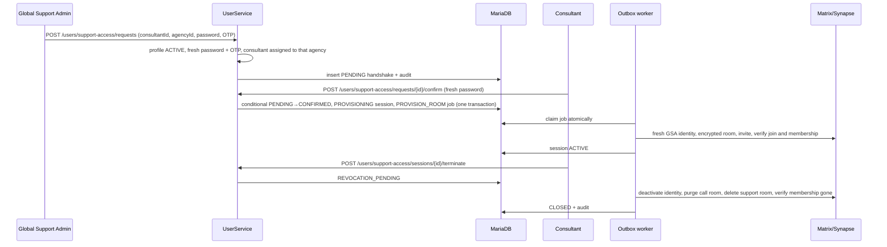

# Global Support Admin and Live Handshake — Technical Implementation

This page describes the implementation behind [ADR-018](ADR-018-global-support-live-handshake.md).
The ADR records the decision; this page shows where the behavior lives, how the components interact,
and what must be verified before release.

## Account provisioning

A Global Support Admin is not a tenant-0 Platform Admin. It is a separate `Admin` row with
`AdminType.SUPPORT`, tenant `0`, and exactly one Keycloak realm role, `global-support-admin`. The
`admin.type` column is widened so the longer value can be stored at all.

`CreateAdminService` creates the identity fail-closed: the Keycloak user is created disabled and
without the privileged role, the admin row and a `support_admin_profile` row are written, and only a
successful provisioning step assigns the role, forces a password change, and requires OTP
onboarding. `GlobalSupportAdminUserService` owns the dedicated create, search, disable, and enable
surface; `SecurityConfig` restricts those endpoints to Platform Admins.

`support_admin_profile.status` is the authoritative operational state (`INVITED`, `PENDING_2FA`,
`ACTIVE`, `DISABLING`, `DISABLED`, `PROVISIONING_FAILED`). Every GSA endpoint consults it in addition
to the bearer token, so a token issued before a disable no longer works. Disabling blocks new
handshakes first, moves running sessions to `REVOCATION_PENDING`, and then withdraws Keycloak and
Matrix access. The live second-factor state is still read from Keycloak; a lookup failure yields
`UNAVAILABLE` and privileged operations fail closed rather than defaulting to active.

At login `IdentityConfig`, `Authority`, and the frontend authority map translate the single realm
role into `AUTHORIZATION_GLOBAL_SUPPORT_ADMIN`. The frontend then selects a GSA-only router; consultant
sessions, advice-seeker data, and tenant administration are unreachable through that authority.

## Request, confirmation, and asynchronous provisioning

`SupportAccessController` accepts only credentials plus `consultantId` and `agencyId`. Actor identity
always comes from the bearer token. `HandshakeService` validates the purpose-specific role pair,
rejects self-handshakes, resolves tenant and agency through
`ConsultantAgencyRepository.existsByConsultantIdAndAgencyIdAndDeleteDateIsNull`, applies the
five-minute lease, and persists failed confirmation attempts even though the request returns a 4xx.
The fifth failure locks the request terminally.

`PENDING → CONFIRMED` is a conditional update. Only a statement that affected exactly one row may go
on to create the session and the outbox job, so two concurrent confirmations can never produce two
sessions. On lapse the operational row is deleted and one `SESSION_NOT_ESTABLISHED` audit entry
remains.

## Session, outbox, and Matrix lifecycle

`support_access_session` holds a unique `handshake_id` and a unique `active_lease_key` that is set
only while the session is non-terminal, which is what actually prevents a second parallel session for
the same GSA, consultant, and agency. States are `PROVISIONING`, `ACTIVE`, `REVOCATION_PENDING`,
`CLOSED`, and `PROVISIONING_FAILED`.

`HandshakeOutboxProcessor` claims one job in a short transaction and performs external calls
afterwards, with bounded exponential retry and a bounded diagnostic message. It handles
`PROVISION_ROOM`, `REVOKE_ACCESS`, and `PURGE_CALL_ROOM`.

`SupportAccessSessionService` creates a **new non-administrative Matrix identity per session** — never
the reused per-admin localpart — then creates a forced-encrypted private room with a deterministic
alias derived from the handshake ID, flushes the room ID before invitations so a retry resumes the
same record, invites only the affected consultant, and verifies both the join and the expected
membership via `getRoomMembers` before writing `ACTIVE`. A partial failure removes the created room;
after the attempt limit the session becomes `PROVISIONING_FAILED` and is shown in the Admin board.

Element Call registers its media room through `PUT /users/support-access/sessions/{id}/call-room`, so
revocation can close the signalling room and the media room.

Expiry, termination, and disabling persist `REVOCATION_PENDING` first. The worker then calls
`deactivateUser` on the temporary identity, `purgeRoom` on the registered call room, `purgeRoom` on
the support room, and confirms through `getRoomMembers` that the membership is gone. Only then is
`CLOSED` written. Anything else stays `REVOCATION_PENDING`, is retried indefinitely, and alerts.

Liquibase changesets add the profile, handshake, audit, outbox, and session tables with their
uniqueness, status, lookup, and expiry indexes.

## Scoped reads, audit, and rollout

`GET /useradmin/support-targets/search` returns minimal consultant and agency data and is reachable
only by an active GSA. `GET /useradmin/support-access/audit` filters entirely server-side: Platform
Admin sees everything, a Tenant Admin only its tenant, an Agency Admin only people in its agencies.
The client never sends a scope ID.

Audit rows carry IDs, timestamp, purpose, target tenant, target agency, outcome, and termination
reason. A retention job deletes them after twelve months together with terminal handshake, session,
and outbox rows. Metrics cover pending and active sessions, the oldest provisioning job,
`REVOCATION_PENDING` older than two minutes, the Matrix retry count, and expired but unverified rooms.

`support-access.enabled` ships disabled and gates only new handshakes; the revocation worker and the
retention job keep running when it is off.

## Release checks

The backend suite covers the migration on real MariaDB, role isolation and the full permission
matrix, mandatory 2FA, immediate effect of disabling despite a valid JWT, fresh credentials, the
attempt limit, two concurrent confirmations yielding exactly one session and one job, expiry leaving
one audit entry and no operational row, outbox redelivery and compensation with every Matrix step
interrupted individually, room encryption state and membership, and the races between expiry, manual
termination, and disabling. The Admin suite covers Platform-Admin-only management and the support
column being absent from the DOM for everyone else. The frontend suite covers the popup, timeout,
confirmation, isolated chat, call, refresh, and immediate local termination on revocation.

`ORISO-E2E/tests/live-support-handshake.spec.ts` is the deployed acceptance gate and runs two
browsers against real Keycloak, MariaDB, and Matrix on Pre-Dev. A skipped run is explicitly not
release evidence.
